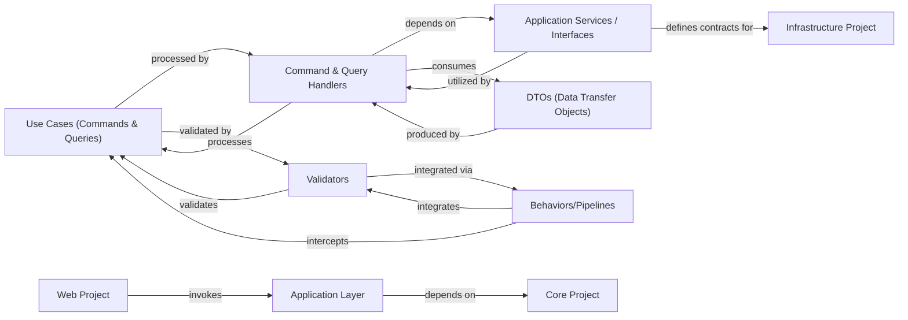

## Details

Abstract Components Overview of a software project.

### Application Layer [[Expand]](./Application_Layer.md)
The orchestrator of application-specific business rules and use cases, bridging the Web Project and Core Project.

**Related Classes/Methods**: _None_

### Use Cases (Commands & Queries)
These are simple data transfer objects (DTOs) that define the specific actions (Commands) or data retrieval operations (Queries) that the application supports. They represent the application's public API and are the entry points for application functionality.

**Related Classes/Methods**:

### Command & Query Handlers
These classes contain the core application logic for processing Commands and Queries. They orchestrate interactions with the domain model (from the Core Project) and utilize interfaces defined within the Application Layer (e.g., IRepository) to interact with external concerns like data persistence.

**Related Classes/Methods**:

### Application Services / Interfaces
This component defines contracts (interfaces) for external services that the Application Layer needs, such as IRepository for data access, IUnitOfWork for transaction management, or other application-specific services that abstract infrastructure details. These interfaces are implemented in the Infrastructure Project.

**Related Classes/Methods**:

### Validators
Contains validation logic, often implemented using FluentValidation, to ensure that the data within Commands and Queries adheres to application-specific business rules and constraints before processing.

**Related Classes/Methods**:

### Behaviors/Pipelines
Implements cross-cutting concerns that apply to all or specific Commands and Queries by intercepting the MediatR pipeline. Examples include logging, validation (via Validators), transaction management, and authorization.

**Related Classes/Methods**:

### DTOs (Data Transfer Objects)
Defines the data structures used for transferring data between the Application Layer and the Web Project (or other presentation layers). These are often the return types for queries or the payload for commands, representing a simplified view of the domain model.

**Related Classes/Methods**:

### Core Project
Contains domain entities, value objects, and domain services that encapsulate core business rules.

**Related Classes/Methods**: _None_

### Web Project
The presentation layer that dispatches commands and queries to the Application Layer.

**Related Classes/Methods**: _None_

### Infrastructure Project
Implements interfaces defined in the Application Layer for external concerns like data persistence.

**Related Classes/Methods**: _None_

### [FAQ](https://github.com/CodeBoarding/GeneratedOnBoardings/tree/main?tab=readme-ov-file#faq)