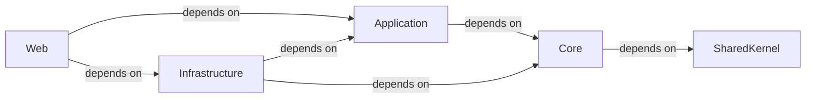

## Details

The project adheres to a strict Clean Architecture pattern, organizing the codebase into distinct layers with clear responsibilities and dependency rules. The identified components align with this pattern, ensuring separation of concerns, testability, and maintainability.

### Core [[Expand]](./Core.md)
The innermost layer, containing the fundamental domain model, enterprise-wide business rules, and abstract interfaces (e.g., repositories). It defines the core business logic and entities, ensuring the domain remains independent of external concerns.

**Related Classes/Methods**:

- `[ProjectName].Core` (1:1)

### Application [[Expand]](./Application.md)
The Use Cases layer, defining application-specific logic and orchestrating interactions between the domain and external concerns. It contains use cases (commands, queries, and their handlers) and application services, depending solely on the Core layer.

**Related Classes/Methods**:

- `[ProjectName].Application` (1:1)

### Infrastructure
Implements interfaces defined in Core (e.g., repository implementations) and Application (e.g., external service integrations). This layer handles external concerns such as data persistence (Entity Framework Core), file system access, and third-party API calls.

**Related Classes/Methods**:

- `[ProjectName].Infrastructure` (1:1)

### Web [[Expand]](./Web.md)
The outermost layer and the entry point of the application (ASP.NET Core). It handles HTTP requests, presentation logic, and orchestrates the flow by invoking use cases from the Application layer. It depends on Application for business logic and Infrastructure for setup and dependency injection.

**Related Classes/Methods**:

- `[ProjectName].Web` (1:1)

### SharedKernel [[Expand]](./SharedKernel.md)
An external package containing common elements, utilities, and shared types that are used across different bounded contexts or layers. This promotes reusability, consistency, and avoids duplication of common code.

**Related Classes/Methods**:

- `[ProjectName].SharedKernel` (1:1)

### [FAQ](https://github.com/CodeBoarding/GeneratedOnBoardings/tree/main?tab=readme-ov-file#faq)