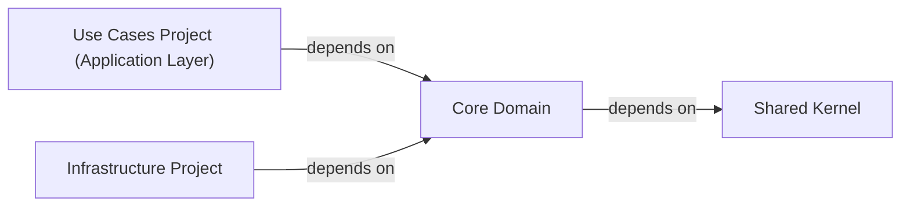

## Details

One paragraph explaining the functionality which is represented by this graph. What the main flow is and what is its purpose.

### Core Domain [[Expand]](./Core_Domain.md)
The Core Domain component is the innermost layer of the application, encapsulating the enterprise-wide business rules, domain entities, value objects, and domain events. It represents the pure business logic, free from any external dependencies on application, infrastructure, or presentation layers. This isolation ensures that the core business rules remain stable and untainted by technological concerns.

**Related Classes/Methods**: _None_

### Shared Kernel [[Expand]](./Shared_Kernel.md)
A component that provides common, cross-domain utilities or base types.

**Related Classes/Methods**: _None_

### Use Cases Project (Application Layer)
A component that defines application-specific logic and orchestrates interactions with domain entities and services.

**Related Classes/Methods**: _None_

### Infrastructure Project
A component that implements interfaces defined within the Core Domain for external concerns like data persistence.

**Related Classes/Methods**: _None_

### [FAQ](https://github.com/CodeBoarding/GeneratedOnBoardings/tree/main?tab=readme-ov-file#faq)