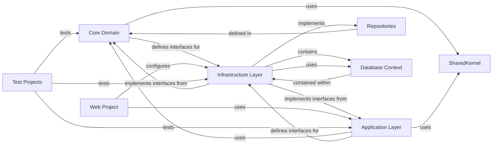

## Details

The feedback indicates that the identified components lack source code references and suggests using `getPythonSourceCode` or `readFile`. However, the components described in the original analysis (e.g., `Core Domain`, `Application Layer`, `Infrastructure Layer`) are abstract architectural layers, not concrete Python modules, classes, or files. These components represent conceptual divisions within a software architecture (like Clean Architecture or Layered Architecture), defining responsibilities and dependencies at a high level. They do not directly correspond to single, identifiable source code files or Python references that `getPythonSourceCode` or `readFile` could retrieve. These tools are designed to fetch actual code from specific Python paths or files, which is not applicable to abstract architectural concepts. Therefore, the feedback is not relevant to the current level of architectural abstraction. The original analysis correctly defines these components conceptually. No architectural changes are required, and the analysis remains valid at its intended abstraction level.

### Core Domain [[Expand]](./Core_Domain.md)
The innermost layer, containing the core business entities, value objects, domain services, and abstract interfaces (e.g., `IRepository`, `IUnitOfWork`). It defines the fundamental business rules and contracts, having no dependencies on outer layers.

**Related Classes/Methods**: _None_

### Application Layer [[Expand]](./Application_Layer.md)
Defines application-specific logic, use cases (commands, queries), DTOs, and application services. It orchestrates interactions between the `Core Domain` and external concerns, depending only on the `Core Domain`. It also defines interfaces for external services that the `Infrastructure Layer` will implement.

**Related Classes/Methods**: _None_

### Infrastructure Layer [[Expand]](./Infrastructure_Layer.md)
Implements the interfaces defined in the `Core Domain` (e.g., concrete `Repository` implementations using Entity Framework Core) and `Application Layer` (e.g., external service clients, file system access). It handles all external concerns, such as data persistence, external API calls, and file system interactions.

**Related Classes/Methods**: _None_

### Web Project
The outermost layer, serving as the presentation layer and entry point for the application (e.g., ASP.NET Core controllers, FastEndpoints). It depends on the `Application Layer` to invoke use cases and on the `Infrastructure Layer` for dependency injection setup and configuration.

**Related Classes/Methods**: _None_

### Repositories
Abstract contracts (interfaces) for data persistence operations, defined within the `Core Domain` to decouple business logic from specific data storage technologies. These interfaces specify the methods for interacting with data.

**Related Classes/Methods**: _None_

### Database Context
The concrete implementation of the data access mechanism, typically an Entity Framework Core `DbContext`, residing exclusively within the `Infrastructure Layer`. It is responsible for managing database connections, mapping domain entities to the database schema, and executing data operations.

**Related Classes/Methods**: _None_

### SharedKernel
A separate package or project containing common, cross-cutting concerns, utilities, or shared domain primitives (e.g., base entities, value objects, common exceptions) that can be referenced by multiple layers without creating circular dependencies or violating the dependency rule.

**Related Classes/Methods**: _None_

### Test Projects
A set of dedicated projects for unit, integration, and acceptance tests for each architectural layer (Core, Application, Infrastructure, Web). These projects ensure high testability, verify functionality, and enforce adherence to architectural boundaries.

**Related Classes/Methods**: _None_

### [FAQ](https://github.com/CodeBoarding/GeneratedOnBoardings/tree/main?tab=readme-ov-file#faq)