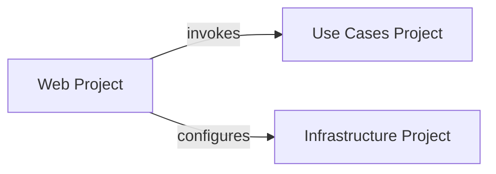

## Details

Abstract Components Overview

### Web Project
The Web Project acts as the application's primary entry point, handling all incoming API requests. Its core responsibilities include orchestrating interactions with the Application Layer (Use Cases Project) by invoking specific use cases, and configuring the various services provided by the Infrastructure Layer to ensure the application's external dependencies are correctly set up. This component strictly adheres to the Clean Architecture principle, depending on the inner Application and Infrastructure layers for its operational capabilities.

**Related Classes/Methods**: _None_

### Use Cases Project
This component encapsulates the application's core business logic and specific use cases. It defines the operations and workflows of the system, remaining independent of external frameworks or databases. It is invoked by the `Web Project` to execute business operations.

**Related Classes/Methods**: _None_

### Infrastructure Project
This component provides concrete implementations for external concerns such as database access, external API integrations, and other technical services. It is configured by the `Web Project` and provides necessary services to the application, typically through interfaces defined in the Application Layer (Use Cases Project).

**Related Classes/Methods**: _None_

### [FAQ](https://github.com/CodeBoarding/GeneratedOnBoardings/tree/main?tab=readme-ov-file#faq)