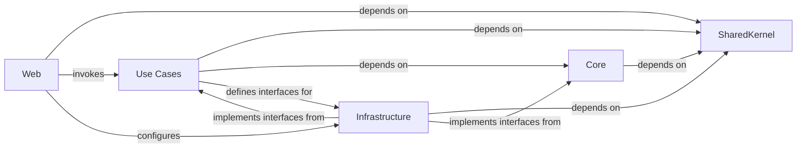

## Details

Abstract Components Overview

### Core [[Expand]](./Core.md)
The innermost layer, encapsulating the domain model, core business entities, value objects, domain events, and business rules. It defines interfaces (ports) for external concerns but has no dependencies on outer layers, ensuring business logic remains independent of infrastructure details.

**Related Classes/Methods**: _None_

### SharedKernel [[Expand]](./SharedKernel.md)
A cross-cutting component containing common elements, utilities, base entities, and value objects shared across multiple layers or bounded contexts to ensure consistency and avoid code duplication. It provides foundational types and helpers used throughout the application.

**Related Classes/Methods**: _None_

### Use Cases
Defines application-specific logic, orchestrates interactions between the UI and the domain, and manages application workflows. It contains commands, queries, and handlers (leveraging MediatR), defining the application's use cases. It depends only on the `Core` and `SharedKernel` projects.

**Related Classes/Methods**: _None_

### Infrastructure
Implements interfaces defined in the `Core` and `Use Cases` layers for external concerns such as data persistence (Entity Framework Core), external services, and third-party integrations. It handles concrete implementations of repositories, database contexts, and other external dependencies.

**Related Classes/Methods**: _None_

### Web [[Expand]](./Web.md)
The entry point of the application, typically an ASP.NET Core project. It handles HTTP requests, authentication, authorization, and presentation logic. It orchestrates the application by invoking use cases from the `Use Cases` layer and configuring infrastructure services through dependency injection.

**Related Classes/Methods**: _None_

### [FAQ](https://github.com/CodeBoarding/GeneratedOnBoardings/tree/main?tab=readme-ov-file#faq)