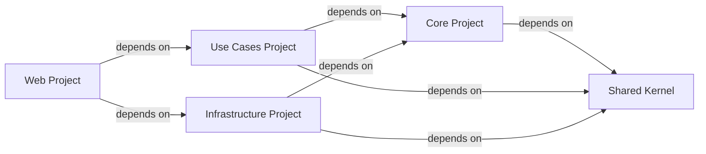

## Details

One paragraph explaining the functionality which is represented by this graph. What the main flow is and what is its purpose.

### Shared Kernel [[Expand]](./Shared_Kernel.md)
Contains common elements, utilities, and shared types (e.g., base classes for entities, common exceptions, value objects) that are used across multiple bounded contexts or layers to avoid duplication and ensure consistency. It acts as an external package.

**Related Classes/Methods**: _None_

### Core Project
Represents the innermost layer, containing the domain model, core business rules, and entities. It has no external dependencies other than the Shared Kernel.

**Related Classes/Methods**: _None_

### Use Cases Project
Defines application-specific business rules, orchestrates the flow of data to and from the entities, and implements application-level services. It depends only on the Core Project and Shared Kernel.

**Related Classes/Methods**: _None_

### Infrastructure Project
Handles external concerns like data persistence (databases), external services, and web framework implementations. It implements interfaces defined in the Core Project and depends on Shared Kernel.

**Related Classes/Methods**: _None_

### Web Project
Acts as the entry point for the application, handling user requests, routing, and presentation. It depends on the Use Cases Project to invoke application logic and the Infrastructure Project for setup and external concerns.

**Related Classes/Methods**: _None_

### [FAQ](https://github.com/CodeBoarding/GeneratedOnBoardings/tree/main?tab=readme-ov-file#faq)