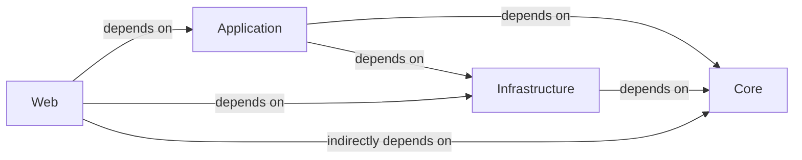

## Details

Analysis of a .NET/C# application following Clean Architecture principles, identifying key components and their relationships.

### Web [[Expand]](./Web.md)
The Web project (sample/src/NimblePros.SampleToDo.AspireHost) is the presentation layer, responsible for receiving user requests (e.g., HTTP requests in an ASP.NET Core application), orchestrating the execution of application-specific logic, and returning appropriate responses. It manages the application's startup, dependency injection configuration, and the overall setup of the web host. It acts as the adapter between the external world and the internal application logic.

**Related Classes/Methods**: _None_

### Application [[Expand]](./Application.md)
This component (conceptually, likely a project like NimblePros.SampleToDo.Application if it existed in the truncated output) contains the application-specific business rules and use cases. It orchestrates the flow of data to and from the Core component and interacts with the Infrastructure layer to fulfill requests. It defines interfaces that the Infrastructure layer must implement.

**Related Classes/Methods**: _None_

### Core [[Expand]](./Core.md)
The Core component (sample/src/NimblePros.SampleToDo.Core) is the heart of the application, containing the enterprise-wide business rules and entities. It is independent of any external concerns like UI, databases, or frameworks. This layer defines the domain model, aggregates, and domain services.

**Related Classes/Methods**: _None_

### Infrastructure
This component (conceptually, likely a project like NimblePros.SampleToDo.Infrastructure or NimblePros.SampleToDo.Data) provides the implementation details for interfaces defined in the Application and Core layers. It handles external concerns such as data persistence (e.g., database access), external API integrations, messaging, and other framework-specific implementations.

**Related Classes/Methods**: _None_

### [FAQ](https://github.com/CodeBoarding/GeneratedOnBoardings/tree/main?tab=readme-ov-file#faq)