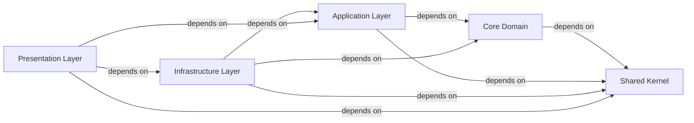

## Details

One paragraph explaining the functionality which is represented by this graph. What the main flow is and what is its purpose.

### Core Domain [[Expand]](./Core_Domain.md)
Encapsulates enterprise-wide business rules, domain entities, value objects, and domain events. It is the innermost layer and has no dependencies on other application layers, only on the `Shared Kernel`.

**Related Classes/Methods**: _None_

### Application Layer [[Expand]](./Application_Layer.md)
Defines application-specific business rules, orchestrates the flow of data, and contains the application's use cases (commands and queries) and their handlers. It also defines interfaces for external services (e.g., `IRepository`).

**Related Classes/Methods**: _None_

### Infrastructure Layer [[Expand]](./Infrastructure_Layer.md)
Implements interfaces defined in the `Core Domain` and `Application Layer` for external concerns such as data access (e.g., Entity Framework Core implementations of repositories), external services, and file system interactions.

**Related Classes/Methods**: _None_

### Presentation Layer [[Expand]](./Presentation_Layer.md)
Acts as the entry point for the application, handling API requests (using FastEndpoints). It orchestrates interactions between the presentation layer and the `Application Layer`, and configures the application's services, including those from the `Infrastructure Layer`.

**Related Classes/Methods**: _None_

### Shared Kernel [[Expand]](./Shared_Kernel.md)
Contains common elements, utilities, and shared types (e.g., base classes for entities, common exceptions, value objects) that are used across multiple bounded contexts or layers to avoid duplication and ensure consistency. It acts as an external package.

**Related Classes/Methods**: _None_

### [FAQ](https://github.com/CodeBoarding/GeneratedOnBoardings/tree/main?tab=readme-ov-file#faq)