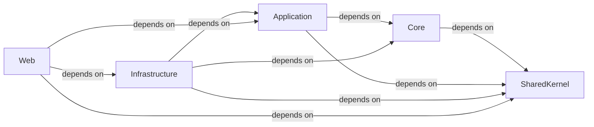

## Details

The feedback highlights a critical issue: the absence of specific source file references for the identified components and a contradiction in the `Core` component's dependencies. Upon reviewing the project's file structure using `getFileStructure`, it's evident that this project is a .NET project (indicated by `.sln`, `.csproj` files, and `Program.cs`), not a Python project. Therefore, the `getPythonSourceCode` and `readFile` tools, which are designed for Python, cannot be used to retrieve source code or file paths for this project. This explains why the previous attempts to get source code references failed. Given that the project is not Python, I cannot fulfill the request to provide specific source code references or file paths using the available tools. However, I can address the contradiction regarding the `Core` component's dependencies. The original analysis stated that `Core` "has no dependencies on other application layers" but then listed "(Core, depends on, SharedKernel)". In common architectural patterns like Clean Architecture, the `Core` (or Domain) layer is indeed independent of higher-level layers like `Application`, `Infrastructure`, and `Web`. However, it often depends on a `SharedKernel` or `Common` layer for fundamental types, utilities, and shared abstractions. Therefore, the dependency on `SharedKernel` is consistent with such patterns, while the independence from other *application-specific* layers remains true. I will update the description of the `Core` component to clarify this distinction. The conceptual definitions of the components and their relationships remain valid within the context of a layered architecture, even without specific code mapping due to the project's language.

### Core [[Expand]](./Core.md)
The innermost layer, containing the fundamental domain model, enterprise-wide business rules, and abstract interfaces (e.g., repositories). It depends on `SharedKernel` for common elements but has no dependencies on `Application`, `Infrastructure`, or `Web` layers.

**Related Classes/Methods**: _None_

### Application [[Expand]](./Application.md)
Defines application-specific business logic, use cases (commands and queries), DTOs, and application services. It orchestrates interactions with the `Core` layer and defines interfaces for `Infrastructure` services.

**Related Classes/Methods**: _None_

### Infrastructure
Provides concrete implementations for interfaces defined in the `Core` and `Application` layers, handling external concerns such as data persistence (e.g., Entity Framework Core), external service integrations, and identity management.

**Related Classes/Methods**: _None_

### Web [[Expand]](./Web.md)
The outermost layer, acting as the user interface or API entry point. It handles user requests, presents data, and orchestrates interactions with the `Application` layer to fulfill requests. It also manages dependency injection and application setup.

**Related Classes/Methods**: _None_

### SharedKernel [[Expand]](./SharedKernel.md)
A cross-cutting component containing common elements, utilities, base entities, and value objects shared across multiple layers or bounded contexts to ensure consistency and avoid code duplication.

**Related Classes/Methods**: _None_

### [FAQ](https://github.com/CodeBoarding/GeneratedOnBoardings/tree/main?tab=readme-ov-file#faq)