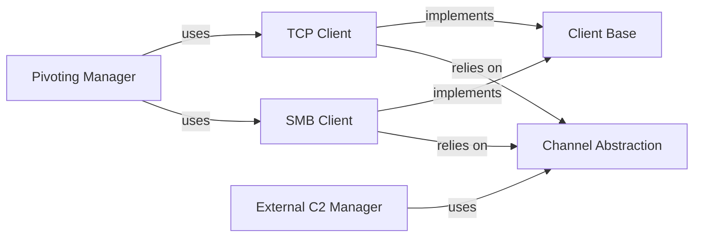

## Details

One paragraph explaining the functionality which is represented by this graph. What the main flow is and what is its purpose.

### Channel Abstraction
Provides a unified, high-level interface for sending and receiving data, abstracting the underlying communication protocol (e.g., TCP, SMB). This allows the beacon's core logic to remain agnostic to the transport mechanism.

**Related Classes/Methods**:

- `src/channel.h`
- `src/channel.cpp`

### Client Base
A foundational component that implements shared logic and a common interface for all communication clients. It likely handles connection state, data serialization/deserialization, and error handling, reducing code duplication across different client types.

**Related Classes/Methods**:

- `src/client.h`
- `src/client.cpp`
- `src/clientint.h`

### TCP Client
A concrete implementation for standard C2 communication over a TCP socket. This component manages the direct, low-level network connection to the C2 server.

**Related Classes/Methods**:

- `src/client_tcp.cpp`

### SMB Client
A concrete implementation for C2 communication over SMB named pipes. This is essential for peer-to-peer communication within a compromised network, enabling beacons to chain together.

**Related Classes/Methods**:

- `src/client_smb.cpp`

### Pivoting Manager
Orchestrates peer-to-peer communication by leveraging other beacons as proxies. It uses the TCP and SMB clients to connect to other implants, effectively turning them into internal routers for C2 traffic.

**Related Classes/Methods**:

- `src/beacon_pivot.cpp`

### External C2 Manager
Implements a framework for loading and managing third-party communication channels. This allows the implant to be extended with new protocols (e.g., DNS, ICMP) via dynamically loaded libraries, decoupling them from the core beacon binary.

**Related Classes/Methods**:

- `src/beacon_extc2.cpp`
- `src/client_smb_extc2.cpp`

### [FAQ](https://github.com/CodeBoarding/GeneratedOnBoardings/tree/main?tab=readme-ov-file#faq)