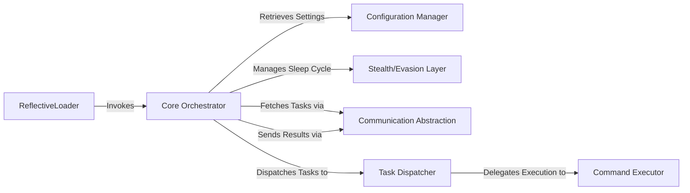

## Details

One paragraph explaining the functionality which is represented by this graph. What the main flow is and what is its purpose.

### Core Orchestrator [[Expand]](./Core_Orchestrator.md)
The central component that manages the agent's lifecycle, initializes other components, and orchestrates the main event loop, acting as the intermediary between communication and task execution.

**Related Classes/Methods**:

- `src/beacon.cpp`

### ReflectiveLoader
Responsible for starting the beacon by reflectively loading it into memory. The `DllMain` function within `ReflectiveDll.cpp` serves as the entry point, which then invokes the Core Orchestrator to begin execution.

**Related Classes/Methods**:

- `src/ReflectiveLoader.cpp`
- `src/ReflectiveDll.cpp`

### Configuration Manager
Loads and provides access to critical beacon settings, such as C2 server addresses, communication keys, and other operational parameters, likely managed during the client initialization phase.

**Related Classes/Methods**:

- `src/client.cpp`
- `src/config.h`

### Stealth/Evasion Layer
Manages the sleep and jitter timing of the beacon's communication cycle to make its network activity less predictable and harder to detect. This logic is embedded within the main loop.

**Related Classes/Methods**:

- `src/beacon.cpp`

### Communication Abstraction
Handles all network communications, abstracting the methods for fetching tasks from the C2 server and sending back results. It supports multiple protocols like TCP and SMB.

**Related Classes/Methods**:

- `src/client.cpp`
- `src/channel.cpp`
- `src/client_tcp.cpp`
- `src/client_smb.cpp`

### Task Dispatcher
Parses instructions received from the C2 server, validates them, and routes them to the appropriate execution function.

**Related Classes/Methods**:

- `src/commands.cpp`

### Command Executor
Executes individual commands on the compromised system as directed by the Task Dispatcher and gathers the output.

**Related Classes/Methods**:

- `src/execute.cpp`

### [FAQ](https://github.com/CodeBoarding/GeneratedOnBoardings/tree/main?tab=readme-ov-file#faq)