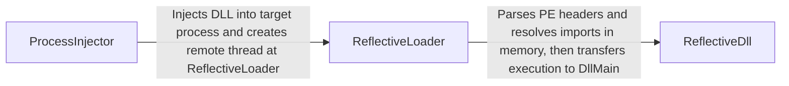

## Details

One paragraph explaining the functionality which is represented by this graph. What the main flow is and what is its purpose.

### ProcessInjector
Initiates the stealth loading sequence. This component is responsible for selecting a suitable target process, allocating a region of memory within it, and writing the entire reflective DLL payload into the allocated space. It then creates a remote thread, setting its starting address to the `ReflectiveLoader` export within the payload, which triggers the in-memory loading process.

**Related Classes/Methods**:

- `src/ReflectiveDLLInjection.h`

### ReflectiveLoader
The core of the evasion mechanism, acting as a custom, in-memory Windows PE loader. Executed first inside the remote process, this position-independent code finds its own DLL's base address in memory. It then parses the PE headers, resolves all necessary function imports by manually walking the PEB, performs base relocations to fix memory addresses, and finally transfers execution to the DLL's true entry point (`DllMain`). Its primary function is to load the main implant without using monitored Win32 API calls like `LoadLibraryA`.

**Related Classes/Methods**:

- `src/ReflectiveLoader.cpp`

### ReflectiveDll
The main implant payload that contains the core C2 functionality. This component exposes the `DllMain` entry point that the `ReflectiveLoader` calls once the DLL is properly mapped and initialized in the target process's memory. Its primary responsibility is to establish command and control, manage the main tasking loop (e.g., sleep, check-in, execute commands), and dispatch tasks to other feature modules. It represents the primary C2 functionality that the entire stealth engine is designed to deliver.

**Related Classes/Methods**:

- `src/ReflectiveDll.cpp`

### [FAQ](https://github.com/CodeBoarding/GeneratedOnBoardings/tree/main?tab=readme-ov-file#faq)