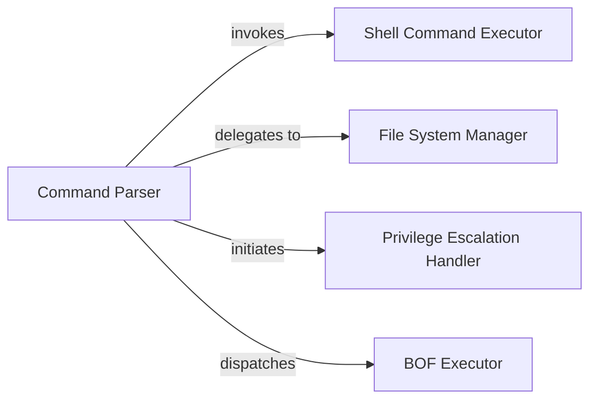

## Details

Based on the provided analysis, the `Task Execution Engine` is a modular subsystem responsible for translating abstract tasks from the C2 server into concrete actions on the compromised host. The component choices are justified by their direct mapping to the discrete, critical capabilities required for post-exploitation, as evidenced by the provided source files.

### Command Parser
Acts as the primary entry point for the Task Execution Engine. It receives task IDs and associated parameters from the CommandDispatcher, validates them, and routes the command to the appropriate specialized execution module.

**Related Classes/Methods**:

- `src/commands.cpp`

### Shell Command Executor
Executes arbitrary shell commands and system utilities. It is responsible for creating a new process (e.g., `cmd.exe`, `powershell.exe`), redirecting its standard input/output/error streams, and capturing the results for exfiltration.

**Related Classes/Methods**:

- `src/execute.cpp`

### File System Manager
Manages all interactions with the host's file system. This includes capabilities like listing directories, reading/writing files, deleting files, and searching for sensitive documents, all executed via direct Win32 API calls to minimize detection.

**Related Classes/Methods**:

- `src/files.cpp`

### Privilege Escalation Handler
Contains logic and exploits to attempt privilege escalation on the target system. It identifies and leverages vulnerabilities or misconfigurations to gain higher-level permissions (e.g., from a standard user to SYSTEM).

**Related Classes/Methods**:

- `src/elevate.cpp`

### BOF Executor
A specialized loader and runtime environment for executing Beacon Object Files (BOFs). It handles in-memory loading, resolves necessary API functions, passes arguments, and executes these lightweight, single-function modules without writing them to disk.

**Related Classes/Methods**:

- `src/boff.cpp`

### [FAQ](https://github.com/CodeBoarding/GeneratedOnBoardings/tree/main?tab=readme-ov-file#faq)