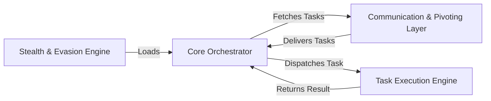

## Details

One paragraph explaining the functionality which is represented by this graph. What the main flow is and what is its purpose.

### Core Orchestrator [[Expand]](./Core_Orchestrator.md)
The central component that manages the agent's lifecycle, initializes other components, and orchestrates the main event loop, acting as the intermediary between communication and task execution.

**Related Classes/Methods**:

- `src/beacon.cpp`
- `src/beacon.h`

### Communication & Pivoting Layer [[Expand]](./Communication_Pivoting_Layer.md)
Abstracts all communication protocols (TCP, SMB) for interacting with the C2 server. It handles data transmission and provides advanced capabilities for pivoting through other compromised hosts and using external C2 channels.

**Related Classes/Methods**:

- `src/channel.cpp`
- `src/client.cpp`
- `src/client_tcp.cpp`
- `src/client_smb.cpp`
- `src/beacon_extc2.cpp`
- `src/beacon_pivot.cpp`

### Task Execution Engine [[Expand]](./Task_Execution_Engine.md)
Parses commands received from the C2 server and executes the corresponding feature module. This component contains the implant's collection of capabilities, such as file system operations, privilege escalation, and in-memory code execution.

**Related Classes/Methods**:

- `src/commands.cpp`
- `src/execute.cpp`
- `src/files.cpp`
- `src/elevate.cpp`
- `src/boff.cpp`

### Stealth & Evasion Engine [[Expand]](./Stealth_Evasion_Engine.md)
Responsible for evading detection by security products. Its primary mechanism is Reflective DLL Injection, which loads the implant into a target process's memory without writing to the disk.

**Related Classes/Methods**:

- `src/ReflectiveDll.cpp`
- `src/ReflectiveLoader.cpp`
- `src/ReflectiveDLLInjection.h`

### [FAQ](https://github.com/CodeBoarding/GeneratedOnBoardings/tree/main?tab=readme-ov-file#faq)