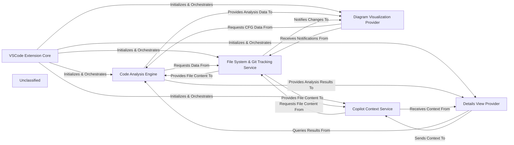

## Details

The CodeBoarding VSCode extension operates around a core VSCode Extension Core that orchestrates the various functionalities. The Code Analysis Engine is central to the extension's purpose, performing static analysis and generating Control Flow Graphs (CFGs). These CFGs are then visualized by the Diagram Visualization Provider and detailed analysis results are presented by the Details View Provider. To enhance AI-assisted development, the Copilot Context Service prepares relevant code context. All these components rely on the File System & Git Tracking Service for accessing file content and monitoring workspace changes.

### VSCode Extension Core
The foundational component responsible for the extension's lifecycle, command registration, and overall orchestration within the VSCode environment.

**Related Classes/Methods**:

- <a href="https://github.com/CodeBoarding/CodeBoarding-vscode/blob/main/src/extension.ts" target="_blank" rel="noopener noreferrer">`src/extension.ts`</a>

### Code Analysis Engine
Performs static code analysis, generates Control Flow Graphs (CFGs), and manages the persistence and retrieval of analysis results.

**Related Classes/Methods**:

- <a href="https://github.com/CodeBoarding/CodeBoarding-vscode/blob/main/src/AnalysisService.ts" target="_blank" rel="noopener noreferrer">`src/AnalysisService.ts`</a>

### Diagram Visualization Provider
Manages the interactive rendering and display of the Control Flow Graph within a dedicated VSCode webview.

**Related Classes/Methods**:

- <a href="https://github.com/CodeBoarding/CodeBoarding-vscode/blob/main/src/DiagramViewProvider.ts" target="_blank" rel="noopener noreferrer">`src/DiagramViewProvider.ts`</a>

### Details View Provider
Provides a dedicated webview panel within VSCode to display detailed information about selected code elements and analysis results.

**Related Classes/Methods**:

- <a href="https://github.com/CodeBoarding/CodeBoarding-vscode/blob/main/src/DetailsViewProvider.ts" target="_blank" rel="noopener noreferrer">`src/DetailsViewProvider.ts`</a>

### Copilot Context Service
Handles the preparation of relevant code snippets and contextual information for AI services like GitHub Copilot.

**Related Classes/Methods**:

- <a href="https://github.com/CodeBoarding/CodeBoarding-vscode/blob/main/src/services/CopilotContextService.ts" target="_blank" rel="noopener noreferrer">`src/services/CopilotContextService.ts`</a>

### File System & Git Tracking Service
Monitors the workspace for file system changes, retrieves file content, and interacts with Git for version control status.

**Related Classes/Methods**:

- <a href="https://github.com/CodeBoarding/CodeBoarding-vscode/blob/main/src/FileTrackingService.ts" target="_blank" rel="noopener noreferrer">`src/FileTrackingService.ts`</a>

### Unclassified
Component for all unclassified files and utility functions (Utility functions/External Libraries/Dependencies)

**Related Classes/Methods**: _None_

### [FAQ](https://github.com/CodeBoarding/GeneratedOnBoardings/tree/main?tab=readme-ov-file#faq)