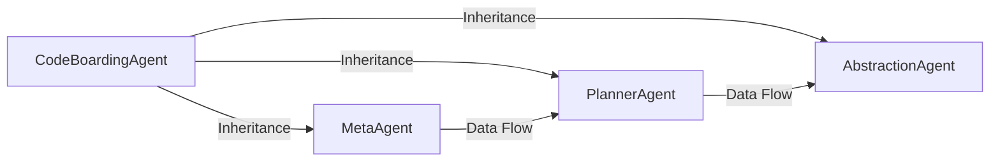

## Details

The AI-Powered Reasoning Engine is the intelligent core of the Codeboard system. It functions as a multi-agent workflow designed to analyze a software project's structure and produce a high-level architectural model. The design follows a classic AI agentic pattern of decomposition and execution, where a complex task is broken down into manageable steps and executed by specialized components.

### CodeBoardingAgent
A foundational, abstract base class providing shared utilities and enforcing a consistent operational structure for all other agents. Its primary role is to handle common tasks like LLM interactions, reducing code duplication and standardizing agent behavior.

**Related Classes/Methods**:

- `agents/codeboarding_agent.py`

### MetaAgent
The entry point and high-level coordinator of the analysis pipeline. It initiates the process by performing a preliminary assessment of the project's metadata, gathering the essential context (e.g., technology stack, key files) required for deeper analysis.

**Related Classes/Methods**:

- `agents/meta_agent.py`

### PlannerAgent
The strategic heart of the engine. This agent receives the high-level context from the MetaAgent and formulates a detailed, step-by-step execution plan. It decomposes the complex goal of "analyze the project" into a sequence of concrete analytical tasks.

**Related Classes/Methods**:

- `agents/planner_agent.py`

### AbstractionAgent
The primary executor of the analysis plan. It consumes the step-by-step plan from the PlannerAgent and uses its specialized tools and methods to perform different types of analysis (e.g., CFG, source code). It is responsible for executing the plan and generating the final architectural model.

**Related Classes/Methods**:

- `agents/abstraction_agent.py`

### [FAQ](https://github.com/CodeBoarding/GeneratedOnBoardings/tree/main?tab=readme-ov-file#faq)