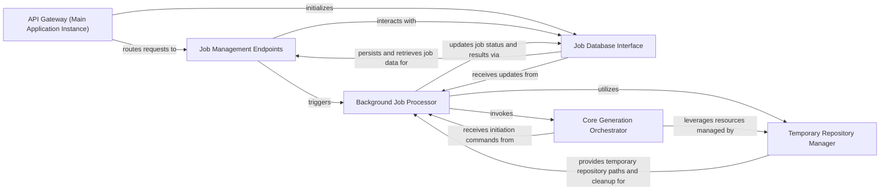

## Details

The API Gateway subsystem encompasses the core FastAPI application instance and its direct interfaces for managing documentation generation jobs. Its boundaries are defined by the `local_app.py` file, which hosts the main application instance and all public-facing API endpoints, and its immediate dependencies for job persistence and background processing.

### API Gateway (Main Application Instance) [[Expand]](./API_Gateway_Main_Application_Instance_.md)
The core FastAPI application instance that defines and serves all external API endpoints for CodeBoarding. It acts as the central dispatcher for incoming HTTP requests, routing them to the appropriate handlers.

**Related Classes/Methods**:

- <a href="https://github.com/CodeBoarding/CodeBoarding/blob/main/local_app.py" target="_blank" rel="noopener noreferrer">`local_app.app`</a>

### Job Management Endpoints
API endpoints responsible for initiating new documentation generation jobs and allowing clients to query the status and retrieve results of existing jobs.

**Related Classes/Methods**:

- <a href="https://github.com/CodeBoarding/CodeBoarding/blob/main/local_app.py#L133-L150" target="_blank" rel="noopener noreferrer">`start_generation_job`:133-150</a>
- <a href="https://github.com/CodeBoarding/CodeBoarding/blob/main/local_app.py#L181-L231" target="_blank" rel="noopener noreferrer">`start_docs_generation_job`:181-231</a>
- <a href="https://github.com/CodeBoarding/CodeBoarding/blob/main/local_app.py#L161-L170" target="_blank" rel="noopener noreferrer">`get_job`:161-170</a>
- <a href="https://github.com/CodeBoarding/CodeBoarding/blob/main/local_app.py#L234-L279" target="_blank" rel="noopener noreferrer">`get_github_action_status`:234-279</a>
- <a href="https://github.com/CodeBoarding/CodeBoarding/blob/main/local_app.py#L282-L311" target="_blank" rel="noopener noreferrer">`list_jobs`:282-311</a>

### Background Job Processor
Asynchronous functions that execute the long-running, resource-intensive documentation generation workflows in the background, preventing API blocking and ensuring responsiveness.

**Related Classes/Methods**:

- <a href="https://github.com/CodeBoarding/CodeBoarding/blob/main/local_app.py#L92-L129" target="_blank" rel="noopener noreferrer">`generate_onboarding`:92-129</a>
- <a href="https://github.com/CodeBoarding/CodeBoarding/blob/main/local_app.py#L314-L378" target="_blank" rel="noopener noreferrer">`process_docs_generation_job`:314-378</a>

### Job Database Interface
Provides a standardized API for performing CRUD operations on job records, managing their state, configuration, and results within the DuckDB database.

**Related Classes/Methods**:

- <a href="https://github.com/CodeBoarding/CodeBoarding/blob/main/local_app.py#L77-L89" target="_blank" rel="noopener noreferrer">`make_job`:77-89</a>
- <a href="https://github.com/CodeBoarding/CodeBoarding/blob/main/duckdb_crud.py#L48-L58" target="_blank" rel="noopener noreferrer">`insert_job`:48-58</a>
- <a href="https://github.com/CodeBoarding/CodeBoarding/blob/main/duckdb_crud.py#L73-L93" target="_blank" rel="noopener noreferrer">`fetch_job`:73-93</a>
- <a href="https://github.com/CodeBoarding/CodeBoarding/blob/main/duckdb_crud.py#L61-L70" target="_blank" rel="noopener noreferrer">`update_job`:61-70</a>
- <a href="https://github.com/CodeBoarding/CodeBoarding/blob/main/duckdb_crud.py#L96-L117" target="_blank" rel="noopener noreferrer">`fetch_all_jobs`:96-117</a>
- <a href="https://github.com/CodeBoarding/CodeBoarding/blob/main/duckdb_crud.py#L15-L44" target="_blank" rel="noopener noreferrer">`init_db`:15-44</a>

### Temporary Repository Manager
Utility functions dedicated to creating and cleaning up temporary directories required for cloning and analyzing source code repositories during the generation process.

**Related Classes/Methods**:

- <a href="https://github.com/CodeBoarding/CodeBoarding/blob/main/utils.py#L13-L17" target="_blank" rel="noopener noreferrer">`create_temp_repo_folder`:13-17</a>
- <a href="https://github.com/CodeBoarding/CodeBoarding/blob/main/utils.py#L20-L24" target="_blank" rel="noopener noreferrer">`remove_temp_repo_folder`:20-24</a>

### Core Generation Orchestrator
The primary entry points that initiate and coordinate the complex, multi-stage process of codebase analysis, AI interpretation, and final documentation output generation.

**Related Classes/Methods**:

- <a href="https://github.com/CodeBoarding/CodeBoarding/blob/main/demo.py#L82-L101" target="_blank" rel="noopener noreferrer">`generate_docs_remote`:82-101</a>
- <a href="https://github.com/CodeBoarding/CodeBoarding/blob/main/github_action.py#L70-L100" target="_blank" rel="noopener noreferrer">`generate_analysis`:70-100</a>

### [FAQ](https://github.com/CodeBoarding/GeneratedOnBoardings/tree/main?tab=readme-ov-file#faq)