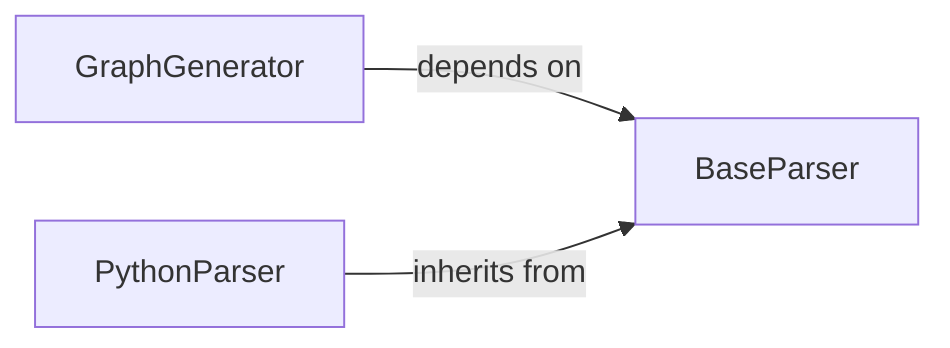

## Details

One paragraph explaining the functionality which is represented by this graph. What the main flow is and what is its purpose.

### GraphGenerator
The central orchestrator of the graph generation process. It takes a file path as input, determines the appropriate language-specific parser, and uses it to construct a unified graph representation (using `networkx`). It manages the entire workflow from file reading to graph construction.

**Related Classes/Methods**:

- `graph_generator.graph_generator.GraphGenerator` (1:1)

### BaseParser
An abstract base class that defines the common interface for all language-specific parsers. It establishes the contract that parsers must follow, including methods to parse a file and extract nodes (like classes and functions) and edges (like calls and inheritance).

**Related Classes/Methods**:

- `graph_generator.parsers.base_parser.BaseParser` (1:1)

### PythonParser
A concrete implementation of the `BaseParser` for analyzing Python source code. It uses the Abstract Syntax Tree (AST) module to traverse the code, identify structural elements (classes, functions, methods), and determine the relationships between them.

**Related Classes/Methods**:

- `graph_generator.parsers.python_parser.PythonParser` (1:1)

### [FAQ](https://github.com/CodeBoarding/GeneratedOnBoardings/tree/main?tab=readme-ov-file#faq)