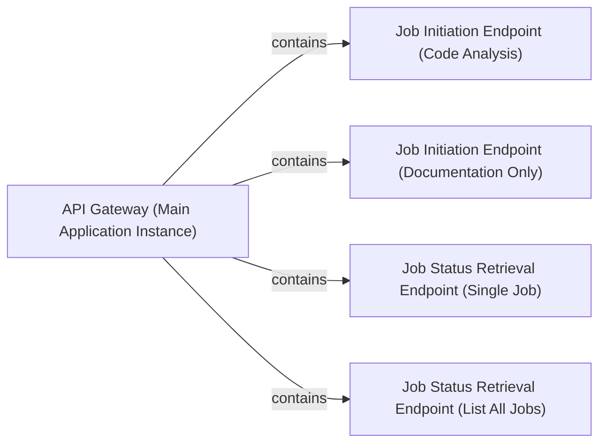

## Details

The API Service (referred to as API Gateway in the analysis summary) forms the external interface of CodeBoarding. Its boundaries are defined by the local_app.py file, specifically the FastAPI application instance (local_app.app) and its exposed RESTful endpoints. This subsystem is responsible for handling all incoming user requests, initiating analysis jobs, and providing job status updates.

### API Gateway (Main Application Instance) [[Expand]](./API_Gateway_Main_Application_Instance_.md)
The core FastAPI application instance that defines and serves all external API endpoints for CodeBoarding. It acts as the central dispatcher for incoming HTTP requests, routing them to the appropriate handlers.

**Related Classes/Methods**:

- `local_app.app`

### Job Initiation Endpoint (Code Analysis) [[Expand]](./Job_Initiation_Endpoint_Code_Analysis_.md)
Handles requests to initiate a comprehensive code analysis and documentation generation job. It validates input parameters and triggers the subsequent orchestration process.

**Related Classes/Methods**:

- `local_app.start_generation_job`:133-150

### Job Initiation Endpoint (Documentation Only) [[Expand]](./Job_Initiation_Endpoint_Documentation_Only_.md)
Manages requests specifically for generating documentation, potentially for pre-analyzed code or a subset of the full analysis, providing a more focused entry point.

**Related Classes/Methods**:

- `local_app.start_docs_generation_job`:181-231

### Job Status Retrieval Endpoint (Single Job)
Provides an interface for clients to query the real-time status and detailed results of a specific, identified job using its unique ID.

**Related Classes/Methods**:

- `local_app.get_job`:161-170

### Job Status Retrieval Endpoint (List All Jobs) [[Expand]](./Job_Status_Retrieval_Endpoint_List_All_Jobs_.md)
Allows clients to retrieve a list of all ongoing or completed jobs, offering an overview of system activity and job history.

**Related Classes/Methods**:

- `local_app.list_jobs`:282-311

### [FAQ](https://github.com/CodeBoarding/GeneratedOnBoardings/tree/main?tab=readme-ov-file#faq)