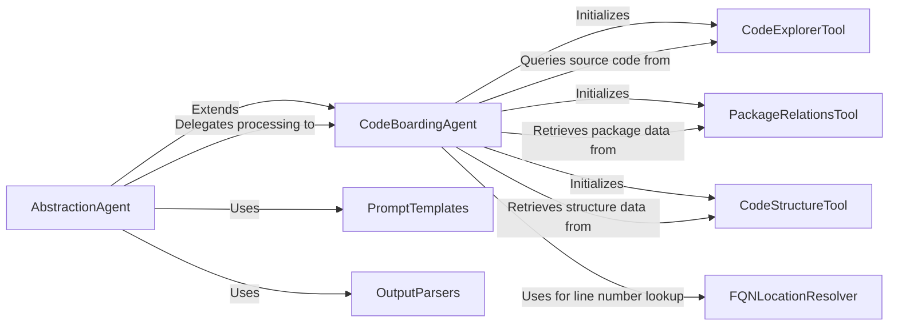

## Component Details

The Abstraction Agent is designed to provide a higher-level view of the codebase. Its primary responsibilities include generating abstract control flow graphs and analyzing source code to derive abstract representations and insights, using specific prompts and parsers for this purpose. It orchestrates the overall code analysis process in stages: CFG analysis, source code analysis, and then generates a conclusive analysis.

### AbstractionAgent
This agent is designed to provide a higher-level view of the codebase. Its primary responsibilities include generating abstract control flow graphs and analyzing source code to derive abstract representations and insights, using specific prompts and parsers for this purpose. It orchestrates the overall code analysis process in stages: CFG analysis, source code analysis, and then generates a conclusive analysis.

**Related Classes/Methods**:

- <a href="https://github.com/CodeBoarding/CodeBoarding/blob/master/agents/abstraction_agent.py#L11-L72" target="_blank" rel="noopener noreferrer">`agents.abstraction_agent.AbstractionAgent` (11:72)</a>
- <a href="https://github.com/CodeBoarding/CodeBoarding/blob/master/agents/abstraction_agent.py#L12-L38" target="_blank" rel="noopener noreferrer">`agents.abstraction_agent.AbstractionAgent:__init__` (12:38)</a>
- <a href="https://github.com/CodeBoarding/CodeBoarding/blob/master/agents/abstraction_agent.py#L40-L45" target="_blank" rel="noopener noreferrer">`agents.abstraction_agent.AbstractionAgent:step_cfg` (40:45)</a>
- <a href="https://github.com/CodeBoarding/CodeBoarding/blob/master/agents/abstraction_agent.py#L47-L62" target="_blank" rel="noopener noreferrer">`agents.abstraction_agent.AbstractionAgent:step_source` (47:62)</a>
- <a href="https://github.com/CodeBoarding/CodeBoarding/blob/master/agents/abstraction_agent.py#L64-L72" target="_blank" rel="noopener noreferrer">`agents.abstraction_agent.AbstractionAgent:generate_analysis` (64:72)</a>

### CodeBoardingAgent
This is the foundational agent class providing common functionalities for all CodeBoarding agents. It handles environment variable setup, LLM initialization, and integrates various tools like CodeExplorerTool, PackageRelationsTool, and CodeStructureTool. It also manages the invocation and parsing of LLM responses and fixes source code reference lines.

**Related Classes/Methods**:

- <a href="https://github.com/CodeBoarding/CodeBoarding/blob/master/agents/agent.py#L19-L89" target="_blank" rel="noopener noreferrer">`agents.agent.CodeBoardingAgent` (19:89)</a>
- <a href="https://github.com/CodeBoarding/CodeBoarding/blob/master/agents/agent.py#L20-L33" target="_blank" rel="noopener noreferrer">`agents.agent.CodeBoardingAgent:__init__` (20:33)</a>
- <a href="https://github.com/CodeBoarding/CodeBoarding/blob/master/agents/agent.py#L35-L39" target="_blank" rel="noopener noreferrer">`agents.agent.CodeBoardingAgent:_setup_env_vars` (35:39)</a>
- <a href="https://github.com/CodeBoarding/CodeBoarding/blob/master/agents/agent.py#L41-L57" target="_blank" rel="noopener noreferrer">`agents.agent.CodeBoardingAgent:_invoke` (41:57)</a>
- <a href="https://github.com/CodeBoarding/CodeBoarding/blob/master/agents/agent.py#L59-L66" target="_blank" rel="noopener noreferrer">`agents.agent.CodeBoardingAgent:_parse_invoke` (59:66)</a>
- <a href="https://github.com/CodeBoarding/CodeBoarding/blob/master/agents/agent.py#L68-L89" target="_blank" rel="noopener noreferrer">`agents.agent.CodeBoardingAgent:fix_source_code_reference_lines` (68:89)</a>

### CodeExplorerTool
This tool is designed to read and retrieve source code content from Python files given a fully qualified name or a file path. It caches file paths within a repository and provides methods to read specific parts of large files, including utility functions for path transformation.

**Related Classes/Methods**:

- <a href="https://github.com/CodeBoarding/CodeBoarding/blob/master/agents/tools/read_source.py#L19-L137" target="_blank" rel="noopener noreferrer">`agents.tools.read_source.CodeExplorerTool` (19:137)</a>
- <a href="https://github.com/CodeBoarding/CodeBoarding/blob/master/agents/tools/read_source.py#L29-L32" target="_blank" rel="noopener noreferrer">`agents.tools.read_source.CodeExplorerTool:__init__` (29:32)</a>
- <a href="https://github.com/CodeBoarding/CodeBoarding/blob/master/agents/tools/read_source.py#L34-L39" target="_blank" rel="noopener noreferrer">`agents.tools.read_source.CodeExplorerTool:walk_dir` (34:39)</a>
- <a href="https://github.com/CodeBoarding/CodeBoarding/blob/master/agents/tools/read_source.py#L49-L114" target="_blank" rel="noopener noreferrer">`agents.tools.read_source.CodeExplorerTool:read_file` (49:114)</a>
- <a href="https://github.com/CodeBoarding/CodeBoarding/blob/master/agents/tools/read_source.py#L131-L137" target="_blank" rel="noopener noreferrer">`agents.tools.read_source.CodeExplorerTool.is_subsequence` (131:137)</a>
- <a href="https://github.com/CodeBoarding/CodeBoarding/blob/master/agents/tools/read_source.py#L117-L129" target="_blank" rel="noopener noreferrer">`agents.tools.read_source.CodeExplorerTool.read_content` (117:129)</a>
- <a href="https://github.com/CodeBoarding/CodeBoarding/blob/master/agents/tools/read_source.py#L144-L147" target="_blank" rel="noopener noreferrer">`agents.tools.read_source:transform_path` (144:147)</a>
- <a href="https://github.com/CodeBoarding/CodeBoarding/blob/master/agents/tools/read_source.py#L140-L141" target="_blank" rel="noopener noreferrer">`agents.tools.read_source:pascal_to_snake_segment` (140:141)</a>

### PackageRelationsTool
This tool provides information about package relationships and hierarchy within a project. It reads pre-generated .dot files containing package dependency graphs to deliver this information.

**Related Classes/Methods**:

- <a href="https://github.com/CodeBoarding/CodeBoarding/blob/master/agents/tools/read_packages.py#L25-L74" target="_blank" rel="noopener noreferrer">`agents.tools.read_packages.PackageRelationsTool` (25:74)</a>
- <a href="https://github.com/CodeBoarding/CodeBoarding/blob/master/agents/tools/read_packages.py#L34-L37" target="_blank" rel="noopener noreferrer">`agents.tools.read_packages.PackageRelationsTool:__init__` (34:37)</a>
- <a href="https://github.com/CodeBoarding/CodeBoarding/blob/master/agents/tools/read_packages.py#L39-L45" target="_blank" rel="noopener noreferrer">`agents.tools.read_packages.PackageRelationsTool.walk_dir` (39:45)</a>
- <a href="https://github.com/CodeBoarding/CodeBoarding/blob/master/agents/tools/read_packages.py#L60-L74" target="_blank" rel="noopener noreferrer">`agents.tools.read_packages.PackageRelationsTool.read_file` (60:74)</a>

### CodeStructureTool
This tool provides information about the class and module structure of a project. It reads pre-generated .dot files containing class structure graphs to offer insights into the codebase's organization.

**Related Classes/Methods**:

- <a href="https://github.com/CodeBoarding/CodeBoarding/blob/master/agents/tools/read_structure.py#L12-L58" target="_blank" rel="noopener noreferrer">`agents.tools.read_structure.CodeStructureTool` (12:58)</a>
- <a href="https://github.com/CodeBoarding/CodeBoarding/blob/master/agents/tools/read_structure.py#L19-L22" target="_blank" rel="noopener noreferrer">`agents.tools.read_structure.CodeStructureTool:__init__` (19:22)</a>
- <a href="https://github.com/CodeBoarding/CodeBoarding/blob/master/agents/tools/read_structure.py#L24-L30" target="_blank" rel="noopener noreferrer">`agents.tools.read_structure.CodeStructureTool.walk_dir` (24:30)</a>
- <a href="https://github.com/CodeBoarding/CodeBoarding/blob/master/agents/tools/read_structure.py#L44-L58" target="_blank" rel="noopener noreferrer">`agents.tools.read_structure.CodeStructureTool.read_file` (44:58)</a>

### FQNLocationResolver
This component is responsible for static analysis of source code, specifically for finding the start and end line numbers of fully qualified names (classes, functions, methods) within a given source code string using AST parsing.

**Related Classes/Methods**:

- <a href="https://github.com/CodeBoarding/CodeBoarding/blob/master/static_analyzer/reference_lines.py#L4-L52" target="_blank" rel="noopener noreferrer">`static_analyzer.reference_lines:find_fqn_location` (4:52)</a>
- <a href="https://github.com/CodeBoarding/CodeBoarding/blob/master/static_analyzer/reference_lines.py#L21-L30" target="_blank" rel="noopener noreferrer">`static_analyzer.reference_lines.find_fqn_location.find_node` (21:30)</a>
- <a href="https://github.com/CodeBoarding/CodeBoarding/blob/master/static_analyzer/reference_lines.py#L37-L47" target="_blank" rel="noopener noreferrer">`static_analyzer.reference_lines.find_fqn_location.LineCounter` (37:47)</a>
- `static_analyzer.reference_lines.find_fqn_location.LineCounter.visit` (42:46)

### PromptTemplates
This component encapsulates the various prompt templates used by the Abstraction Agent for different stages of analysis (CFG, source, conclusive analysis).

**Related Classes/Methods**:

- `agents.prompts:CFG_MESSAGE` (full file reference)
- `agents.prompts:SOURCE_MESSAGE` (full file reference)
- `agents.prompts:SYSTEM_MESSAGE` (full file reference)
- `agents.prompts:CONCLUSIVE_ANALYSIS_MESSAGE` (full file reference)

### OutputParsers
This component defines the Pydantic output parsers used by the Abstraction Agent to structure and validate the LLM responses for CFG analysis and general analysis insights.

**Related Classes/Methods**:

- <a href="https://github.com/CodeBoarding/CodeBoarding/blob/master/agents/agent_responses.py#L54-L69" target="_blank" rel="noopener noreferrer">`agents.agent_responses:AnalysisInsights` (54:69)</a>
- <a href="https://github.com/CodeBoarding/CodeBoarding/blob/master/agents/agent_responses.py#L89-L101" target="_blank" rel="noopener noreferrer">`agents.agent_responses:CFGAnalysisInsights` (89:101)</a>

### [FAQ](https://github.com/CodeBoarding/GeneratedOnBoardings/tree/main?tab=readme-ov-file#faq)