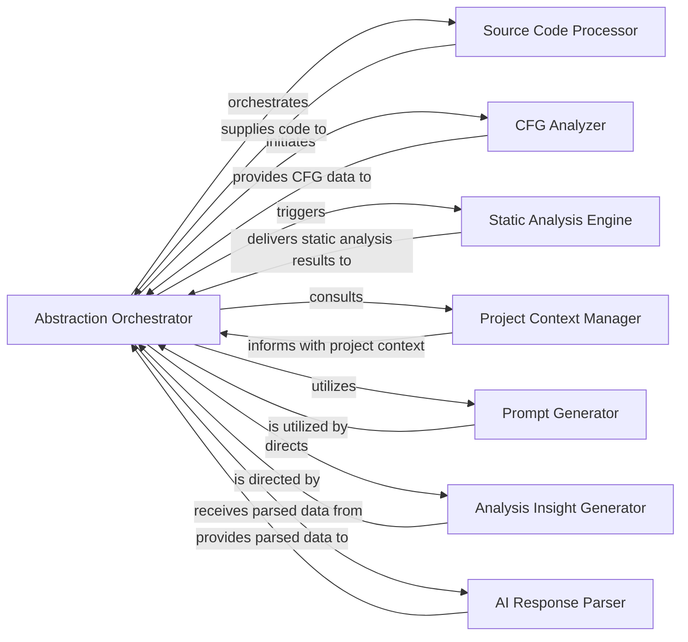

## Details

The conceptual framework is strong, with clear component definitions and well-defined responsibilities. The previous analysis lacked source file references, which prevented thorough verification. This revision addresses that by linking each component to its corresponding code artifacts, enhancing both documentation and diagram clarity.

### Abstraction Orchestrator
The central component responsible for orchestrating the entire code abstraction and analysis workflow. It manages the sequence of operations, coordinates with other components, and synthesizes complex data into abstract representations and actionable insights. This component embodies the core logic of the `Abstraction Engine`.

**Related Classes/Methods**:

- <a href="https://github.com/CodeBoarding/CodeBoarding/blob/main/diagram_analysis/diagram_generator.py#L25-L202" target="_blank" rel="noopener noreferrer">`diagram_analysis.diagram_generator.DiagramGenerator`:25-202</a>

### Source Code Processor
Responsible for providing the raw source code for initial processing and analysis. It acts as the entry point for code data into the abstraction pipeline by scanning the repository and setting up language-specific clients.

**Related Classes/Methods**:

- <a href="https://github.com/CodeBoarding/CodeBoarding/blob/main/static_analyzer/scanner.py#L13-L66" target="_blank" rel="noopener noreferrer">`static_analyzer.scanner.ProjectScanner`:13-66</a>
- <a href="https://github.com/CodeBoarding/CodeBoarding/blob/main/static_analyzer/__init__.py" target="_blank" rel="noopener noreferrer">`static_analyzer.create_clients`</a>

### CFG Analyzer
Analyzes the source code to generate Control Flow Graph (CFG) data, which is then supplied to the `Abstraction Orchestrator` to understand program execution paths and logic. This is performed by language-specific static analysis clients.

**Related Classes/Methods**:

- <a href="https://github.com/CodeBoarding/CodeBoarding/blob/main/static_analyzer/analysis_result.py" target="_blank" rel="noopener noreferrer">`static_analyzer.analysis_result.StaticAnalysisResults.add_cfg`</a>

### Static Analysis Engine [[Expand]](./Static_Analysis_Engine.md)
Performs comprehensive static analysis on the codebase, identifying patterns, potential issues, structural information, class hierarchies, and package dependencies. These results are delivered to the `Abstraction Orchestrator` for deeper architectural understanding.

**Related Classes/Methods**:

- <a href="https://github.com/CodeBoarding/CodeBoarding/blob/main/static_analyzer/analysis_result.py#L6-L138" target="_blank" rel="noopener noreferrer">`static_analyzer.analysis_result.StaticAnalysisResults`:6-138</a>
- <a href="https://github.com/CodeBoarding/CodeBoarding/blob/main/static_analyzer/analysis_result.py" target="_blank" rel="noopener noreferrer">`static_analyzer.analysis_result.StaticAnalysisResults.add_references`</a>
- <a href="https://github.com/CodeBoarding/CodeBoarding/blob/main/static_analyzer/analysis_result.py" target="_blank" rel="noopener noreferrer">`static_analyzer.analysis_result.StaticAnalysisResults.add_class_hierarchy`</a>
- <a href="https://github.com/CodeBoarding/CodeBoarding/blob/main/static_analyzer/analysis_result.py" target="_blank" rel="noopener noreferrer">`static_analyzer.analysis_result.StaticAnalysisResults.add_package_dependencies`</a>

### Project Context Manager
Provides the `Abstraction Orchestrator` with broader project context, such as configuration, dependencies, and high-level project structure, to enrich the analysis and abstraction process. This is managed by a dedicated meta-agent.

**Related Classes/Methods**:

- <a href="https://github.com/CodeBoarding/CodeBoarding/blob/main/agents/meta_agent.py#L15-L37" target="_blank" rel="noopener noreferrer">`agents.meta_agent.MetaAgent`:15-37</a>

### Prompt Generator
Utilized by the various agents within the `Abstraction Engine` to construct and format prompts for Large Language Models (LLMs), ensuring that the analysis data is presented effectively for AI interpretation. This functionality is encapsulated within the agents themselves.

**Related Classes/Methods**:

- <a href="https://github.com/CodeBoarding/CodeBoarding/blob/main/agents/abstraction_agent.py#L14-L100" target="_blank" rel="noopener noreferrer">`agents.abstraction_agent.AbstractionAgent`:14-100</a>

### AI Response Parser
Responsible for parsing and interpreting the responses received from the AI models, transforming raw AI output into structured data that the `Abstraction Orchestrator` can further process. This functionality is embedded within the agents that interact with LLMs.

**Related Classes/Methods**:

- <a href="https://github.com/CodeBoarding/CodeBoarding/blob/main/agents/validator_agent.py#L15-L143" target="_blank" rel="noopener noreferrer">`agents.validator_agent.ValidatorAgent`:15-143</a>

### Analysis Insight Generator
Directed by the `Abstraction Orchestrator`, this component synthesizes all processed data and AI interpretations into the final high-level architectural insights, component definitions, and interaction diagrams.

**Related Classes/Methods**:

- <a href="https://github.com/CodeBoarding/CodeBoarding/blob/main/agents/abstraction_agent.py" target="_blank" rel="noopener noreferrer">`agents.abstraction_agent.AbstractionAgent.run`</a>
- <a href="https://github.com/CodeBoarding/CodeBoarding/blob/main/agents/details_agent.py" target="_blank" rel="noopener noreferrer">`agents.details_agent.DetailsAgent.step_analysis`</a>

### [FAQ](https://github.com/CodeBoarding/GeneratedOnBoardings/tree/main?tab=readme-ov-file#faq)