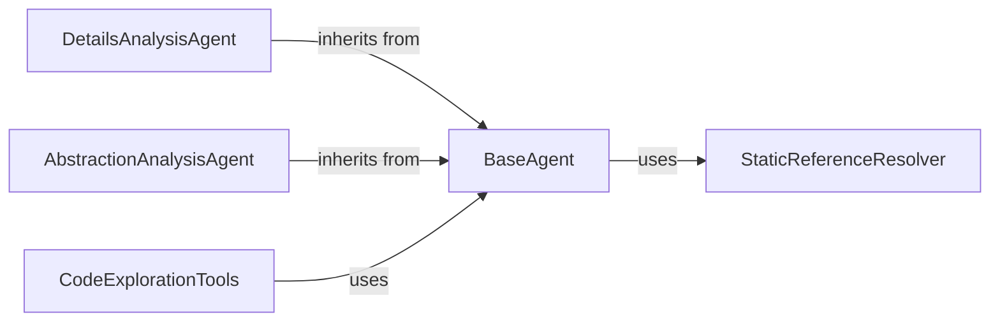

## Component Details

The Agent Framework provides the core architecture for all intelligent agents within CodeBoarding. It establishes fundamental functionalities such as environment setup, language model initialization, and mechanisms for tool invocation and result parsing. This framework also includes capabilities for resolving source code reference lines, enabling agents to perform detailed code analysis and generate high-level abstractions.

### BaseAgent
Provides foundational functionalities for all CodeBoarding agents, including environment setup, tool initialization, and core invocation/parsing mechanisms. It serves as the common interface for agent operations.

**Related Classes/Methods**:

- <a href="https://github.com/CodeBoarding/CodeBoarding/blob/master/agents/agent.py#L19-L89" target="_blank" rel="noopener noreferrer">`CodeBoarding.agents.agent.CodeBoardingAgent` (19:89)</a>

### DetailsAnalysisAgent
Specializes in in-depth code analysis, focusing on control flow graphs (CFG), sub-CFG, and enhancing structural understanding of the codebase. It leverages the BaseAgent's capabilities for its analytical tasks.

**Related Classes/Methods**:

- <a href="https://github.com/CodeBoarding/CodeBoarding/blob/master/agents/details_agent.py#L12-L76" target="_blank" rel="noopener noreferrer">`CodeBoarding.agents.details_agent.DetailsAgent` (12:76)</a>

### AbstractionAnalysisAgent
Concentrates on generating high-level abstractions and insights from the codebase, utilizing CFG and source code analysis. It builds upon the BaseAgent's core functionalities to achieve its abstraction goals.

**Related Classes/Methods**:

- <a href="https://github.com/CodeBoarding/CodeBoarding/blob/master/agents/abstraction_agent.py#L11-L72" target="_blank" rel="noopener noreferrer">`CodeBoarding.agents.abstraction_agent.AbstractionAgent` (11:72)</a>

### CodeExplorationTools
A collection of utility tools designed to interact with the codebase, enabling functionalities such as reading source code, understanding package relationships, and analyzing class structures. These tools are integral for agents to gather necessary code information.

**Related Classes/Methods**:

- <a href="https://github.com/CodeBoarding/CodeBoarding/blob/master/agents/tools/read_source.py#L19-L137" target="_blank" rel="noopener noreferrer">`CodeBoarding.agents.tools.read_source.CodeExplorerTool` (19:137)</a>
- <a href="https://github.com/CodeBoarding/CodeBoarding/blob/master/agents/tools/read_packages.py#L25-L74" target="_blank" rel="noopener noreferrer">`CodeBoarding.agents.tools.read_packages.PackageRelationsTool` (25:74)</a>
- <a href="https://github.com/CodeBoarding/CodeBoarding/blob/master/agents/tools/read_structure.py#L12-L58" target="_blank" rel="noopener noreferrer">`CodeBoarding.agents.tools.read_structure.CodeStructureTool` (12:58)</a>

### StaticReferenceResolver
Responsible for static analysis tasks, specifically identifying and resolving fully qualified name (FQN) locations within the source code. This component supports agents in pinpointing exact code references.

**Related Classes/Methods**:

- <a href="https://github.com/CodeBoarding/CodeBoarding/blob/master/static_analyzer/reference_lines.py#L4-L52" target="_blank" rel="noopener noreferrer">`static_analyzer.reference_lines.find_fqn_location` (4:52)</a>

### [FAQ](https://github.com/CodeBoarding/GeneratedOnBoardings/tree/main?tab=readme-ov-file#faq)