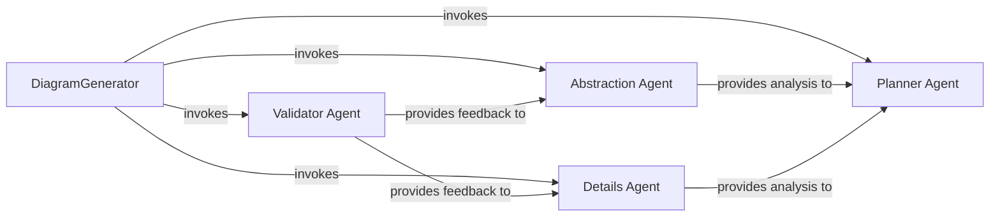

## Details

One paragraph explaining the functionality which is represented by this graph. What the main flow is and what is its purpose.

### DiagramGenerator
The central orchestrator of the analysis subsystem. It initializes all specialized agents and manages the overall workflow. It invokes the Abstraction, Details, and Validator agents in a coordinated sequence to build a complete system analysis, rather than following a rigid, linear pipeline.

**Related Classes/Methods**:

- <a href="https://github.com/CodeBoarding/CodeBoarding/blob/main/diagram_analysis/diagram_generator.py#L23-L211" target="_blank" rel="noopener noreferrer">`diagram_analysis.diagram_generator.DiagramGenerator` (23:211)</a>

### Planner Agent
Invoked by the DiagramGenerator, this agent is responsible for identifying the next set of components that require detailed analysis. It takes the output from the Abstraction or Details agents to determine the scope of subsequent analysis steps.

**Related Classes/Methods**:

- <a href="https://github.com/CodeBoarding/CodeBoarding/blob/main/agents/planner_agent.py#L9-L27" target="_blank" rel="noopener noreferrer">`agents.planner_agent.PlannerAgent` (9:27)</a>

### Abstraction Agent
Performs the initial, high-level analysis of the entire project. It is invoked by the DiagramGenerator to identify the main architectural components and their relationships, creating a foundational overview for the detailed analysis.

**Related Classes/Methods**:

- <a href="https://github.com/CodeBoarding/CodeBoarding/blob/main/agents/abstraction_agent.py#L9-L95" target="_blank" rel="noopener noreferrer">`agents.abstraction_agent.AbstractionAgent` (9:95)</a>

### Details Agent
Invoked by the DiagramGenerator to perform a deep-dive analysis on a single, specific component identified by the Planner Agent. It inspects source code, configurations, and call graphs to understand its internal logic and structure.

**Related Classes/Methods**:

- <a href="https://github.com/CodeBoarding/CodeBoarding/blob/main/agents/details_agent.py#L11-L103" target="_blank" rel="noopener noreferrer">`agents.details_agent.DetailsAgent` (11:103)</a>

### Validator Agent
Acts as a quality assurance gate. It is invoked by the DiagramGenerator to review the analyses produced by both the Abstraction and Details agents, ensuring their claims are consistent and factually grounded in the source code.

**Related Classes/Methods**:

- <a href="https://github.com/CodeBoarding/CodeBoarding/blob/main/agents/validator_agent.py#L10-L89" target="_blank" rel="noopener noreferrer">`agents.validator_agent.ValidatorAgent` (10:89)</a>

### [FAQ](https://github.com/CodeBoarding/GeneratedOnBoardings/tree/main?tab=readme-ov-file#faq)