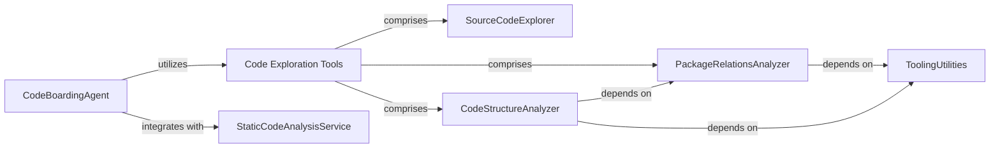

## Component Details

This graph illustrates the structure and interactions within the 'Code Exploration Tools' subsystem and its related components. The central 'CodeBoardingAgent' orchestrates the use of various tools, including the 'Code Exploration Tools' suite, to analyze and modify code. The 'Code Exploration Tools' component acts as an interface to the codebase, providing functionalities for reading source code, exploring package relationships, and understanding code structure through its sub-components: 'SourceCodeExplorer', 'PackageRelationsAnalyzer', and 'CodeStructureAnalyzer'. These analyzers, in turn, leverage 'ToolingUtilities' for common operations like reading dot files. Additionally, the 'CodeBoardingAgent' integrates with an external 'StaticCodeAnalysisService' to locate fully qualified names within the source code.

### Code Exploration Tools
This component provides a set of utility tools for agents to interact with the codebase. It includes functionalities for reading source code files, exploring package relationships, and understanding the overall code structure, acting as an interface to the underlying codebase and static analysis artifacts.

**Related Classes/Methods**:

- <a href="https://github.com/CodeBoarding/CodeBoarding/blob/master/agents/tools/read_packages.py#L25-L74" target="_blank" rel="noopener noreferrer">`CodeBoarding.agents.tools.read_packages.PackageRelationsTool` (25:74)</a>
- <a href="https://github.com/CodeBoarding/CodeBoarding/blob/master/agents/tools/read_source.py#L19-L137" target="_blank" rel="noopener noreferrer">`CodeBoarding.agents.tools.read_source.CodeExplorerTool` (19:137)</a>
- <a href="https://github.com/CodeBoarding/CodeBoarding/blob/master/agents/tools/read_structure.py#L12-L58" target="_blank" rel="noopener noreferrer">`CodeBoarding.agents.tools.read_structure.CodeStructureTool` (12:58)</a>

### CodeBoardingAgent
The central orchestrator that initializes and leverages various tools to perform code analysis and modifications. It sets up environment variables and fixes source code references.

**Related Classes/Methods**:

- <a href="https://github.com/CodeBoarding/CodeBoarding/blob/master/agents/agent.py#L20-L33" target="_blank" rel="noopener noreferrer">`CodeBoarding.agents.agent.CodeBoardingAgent:__init__` (20:33)</a>
- <a href="https://github.com/CodeBoarding/CodeBoarding/blob/master/agents/agent.py#L35-L39" target="_blank" rel="noopener noreferrer">`CodeBoarding.agents.agent.CodeBoardingAgent._setup_env_vars` (35:39)</a>
- <a href="https://github.com/CodeBoarding/CodeBoarding/blob/master/agents/agent.py#L68-L89" target="_blank" rel="noopener noreferrer">`CodeBoarding.agents.agent.CodeBoardingAgent:fix_source_code_reference_lines` (68:89)</a>

### SourceCodeExplorer
A tool responsible for navigating the file system and reading source code content. It provides functionalities to check for subsequences within files and transform file paths.

**Related Classes/Methods**:

- <a href="https://github.com/CodeBoarding/CodeBoarding/blob/master/agents/tools/read_source.py#L19-L137" target="_blank" rel="noopener noreferrer">`CodeBoarding.agents.tools.read_source.CodeExplorerTool` (19:137)</a>
- <a href="https://github.com/CodeBoarding/CodeBoarding/blob/master/agents/tools/read_source.py#L29-L32" target="_blank" rel="noopener noreferrer">`CodeBoarding.agents.tools.read_source.CodeExplorerTool:__init__` (29:32)</a>
- <a href="https://github.com/CodeBoarding/CodeBoarding/blob/master/agents/tools/read_source.py#L34-L39" target="_blank" rel="noopener noreferrer">`CodeBoarding.agents.tools.read_source.CodeExplorerTool.walk_dir` (34:39)</a>
- <a href="https://github.com/CodeBoarding/CodeBoarding/blob/master/agents/tools/read_source.py#L41-L47" target="_blank" rel="noopener noreferrer">`CodeBoarding.agents.tools.read_source.CodeExplorerTool._run` (41:47)</a>
- <a href="https://github.com/CodeBoarding/CodeBoarding/blob/master/agents/tools/read_source.py#L49-L114" target="_blank" rel="noopener noreferrer">`CodeBoarding.agents.tools.read_source.CodeExplorerTool.read_file` (49:114)</a>
- <a href="https://github.com/CodeBoarding/CodeBoarding/blob/master/agents/tools/read_source.py#L131-L137" target="_blank" rel="noopener noreferrer">`CodeBoarding.agents.tools.read_source.CodeExplorerTool.is_subsequence` (131:137)</a>
- <a href="https://github.com/CodeBoarding/CodeBoarding/blob/master/agents/tools/read_source.py#L117-L129" target="_blank" rel="noopener noreferrer">`CodeBoarding.agents.tools.read_source.CodeExplorerTool.read_content` (117:129)</a>
- <a href="https://github.com/CodeBoarding/CodeBoarding/blob/master/agents/tools/read_source.py#L144-L147" target="_blank" rel="noopener noreferrer">`CodeBoarding.agents.tools.read_source.transform_path` (144:147)</a>
- <a href="https://github.com/CodeBoarding/CodeBoarding/blob/master/agents/tools/read_source.py#L140-L141" target="_blank" rel="noopener noreferrer">`CodeBoarding.agents.tools.read_source.pascal_to_snake_segment` (140:141)</a>

### PackageRelationsAnalyzer
A tool designed to analyze and provide information about package dependencies and relationships within the codebase, typically by reading pre-generated dot files.

**Related Classes/Methods**:

- <a href="https://github.com/CodeBoarding/CodeBoarding/blob/master/agents/tools/read_packages.py#L25-L74" target="_blank" rel="noopener noreferrer">`CodeBoarding.agents.tools.read_packages.PackageRelationsTool` (25:74)</a>
- <a href="https://github.com/CodeBoarding/CodeBoarding/blob/master/agents/tools/read_packages.py#L34-L37" target="_blank" rel="noopener noreferrer">`CodeBoarding.agents.tools.read_packages.PackageRelationsTool:__init__` (34:37)</a>
- <a href="https://github.com/CodeBoarding/CodeBoarding/blob/master/agents/tools/read_packages.py#L39-L45" target="_blank" rel="noopener noreferrer">`CodeBoarding.agents.tools.read_packages.PackageRelationsTool.walk_dir` (39:45)</a>
- <a href="https://github.com/CodeBoarding/CodeBoarding/blob/master/agents/tools/read_packages.py#L47-L58" target="_blank" rel="noopener noreferrer">`CodeBoarding.agents.tools.read_packages.PackageRelationsTool._run` (47:58)</a>
- <a href="https://github.com/CodeBoarding/CodeBoarding/blob/master/agents/tools/read_packages.py#L60-L74" target="_blank" rel="noopener noreferrer">`CodeBoarding.agents.tools.read_packages.PackageRelationsTool.read_file` (60:74)</a>
- <a href="https://github.com/CodeBoarding/CodeBoarding/blob/master/agents/tools/read_packages.py#L17-L22" target="_blank" rel="noopener noreferrer">`CodeBoarding.agents.tools.read_packages.NoRootPackageFoundError` (17:22)</a>

### CodeStructureAnalyzer
A tool focused on understanding and presenting the overall structural organization of the code, often by parsing and interpreting structural data from dot files.

**Related Classes/Methods**:

- <a href="https://github.com/CodeBoarding/CodeBoarding/blob/master/agents/tools/read_structure.py#L12-L58" target="_blank" rel="noopener noreferrer">`CodeBoarding.agents.tools.read_structure.CodeStructureTool` (12:58)</a>
- <a href="https://github.com/CodeBoarding/CodeBoarding/blob/master/agents/tools/read_structure.py#L19-L22" target="_blank" rel="noopener noreferrer">`CodeBoarding.agents.tools.read_structure.CodeStructureTool:__init__` (19:22)</a>
- <a href="https://github.com/CodeBoarding/CodeBoarding/blob/master/agents/tools/read_structure.py#L24-L30" target="_blank" rel="noopener noreferrer">`CodeBoarding.agents.tools.read_structure.CodeStructureTool.walk_dir` (24:30)</a>
- <a href="https://github.com/CodeBoarding/CodeBoarding/blob/master/agents/tools/read_structure.py#L32-L42" target="_blank" rel="noopener noreferrer">`CodeBoarding.agents.tools.read_structure.CodeStructureTool._run` (32:42)</a>
- <a href="https://github.com/CodeBoarding/CodeBoarding/blob/master/agents/tools/read_structure.py#L44-L58" target="_blank" rel="noopener noreferrer">`CodeBoarding.agents.tools.read_structure.CodeStructureTool.read_file` (44:58)</a>

### ToolingUtilities
A collection of common utility functions that support the operations of various tools, such as reading specific file formats like dot files.

**Related Classes/Methods**:

- <a href="https://github.com/CodeBoarding/CodeBoarding/blob/master/agents/tools/utils.py#L6-L19" target="_blank" rel="noopener noreferrer">`CodeBoarding.agents.tools.utils.read_dot_file` (6:19)</a>

### StaticCodeAnalysisService
An external service or module that performs static analysis on code, specifically to locate fully qualified names (FQNs) within source code files.

**Related Classes/Methods**:

- <a href="https://github.com/CodeBoarding/CodeBoarding/blob/master/static_analyzer/reference_lines.py#L4-L52" target="_blank" rel="noopener noreferrer">`CodeBoarding.static_analyzer.reference_lines.find_fqn_location` (4:52)</a>

### [FAQ](https://github.com/CodeBoarding/GeneratedOnBoardings/tree/main?tab=readme-ov-file#faq)