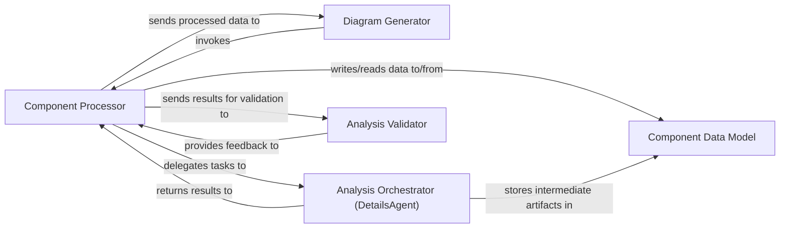

## Details

The `Diagram Generator` initiates the entire analysis process, acting as the primary orchestrator. It delegates the in-depth analysis of individual components to the `Component Processor`. The `Component Processor` then coordinates with the `Analysis Orchestrator (DetailsAgent)` to perform detailed code analysis, including CFG generation and structural enhancements. The results from the `Analysis Orchestrator` are then passed to the `Analysis Validator` for quality assurance. Both the `Component Processor` and `Analysis Orchestrator` interact with the `Component Data Model` to store and retrieve analysis artifacts and results, ensuring data consistency throughout the process. Finally, the processed component data is returned to the `Diagram Generator` for further processing and diagram generation. This architecture ensures a modular and verifiable approach to generating comprehensive diagrams and documentation.

### Component Processor [[Expand]](./Component_Processor.md)
Orchestrates the in-depth analysis of a single component. This includes applying feedback, delegating detailed analysis steps, validating results, and planning for new components. It acts as the central coordinator for the component-level analysis workflow.

**Related Classes/Methods**:

- <a href="https://github.com/CodeBoarding/CodeBoarding/blob/main/diagram_analysis/diagram_generator.py" target="_blank" rel="noopener noreferrer">`diagram_analysis.diagram_generator.DiagramGenerator:process_component`</a>

### Diagram Generator
The overarching component responsible for initiating and managing the process of preparing component data for diagram generation. It serves as the entry point for the entire diagram and documentation generation workflow, invoking the `Component Processor` for individual component analysis.

**Related Classes/Methods**:

- <a href="https://github.com/CodeBoarding/CodeBoarding/blob/main/diagram_analysis/diagram_generator.py#L25-L202" target="_blank" rel="noopener noreferrer">`diagram_analysis.diagram_generator.DiagramGenerator`:25-202</a>

### Analysis Orchestrator (DetailsAgent)
An internal component responsible for executing specific, detailed analysis techniques on a component. This includes generating sub-CFG, full CFG, enhancing structural information, and performing deeper code analysis.

**Related Classes/Methods**:

- <a href="https://github.com/CodeBoarding/CodeBoarding/blob/main/diagram_analysis/diagram_generator.py" target="_blank" rel="noopener noreferrer">`diagram_analysis.diagram_generator.DetailsAgent`</a>

### Analysis Validator
An internal component responsible for validating the results produced by the detailed analysis. It ensures the quality, correctness, and consistency of the analysis output before it's used for further processing or diagram generation.

**Related Classes/Methods**:

- <a href="https://github.com/CodeBoarding/CodeBoarding/blob/main/diagram_analysis/diagram_generator.py" target="_blank" rel="noopener noreferrer">`diagram_analysis.diagram_generator.ValidatorAgent`</a>

### Component Data Model
An implicit component representing the structured data storage for analyzed components, their properties, relationships, and intermediate analysis artifacts. It provides a consistent representation and persistence mechanism for all information gathered during the analysis and generation process.

**Related Classes/Methods**:

- <a href="https://github.com/CodeBoarding/CodeBoarding/blob/main/diagram_analysis/analysis_json.py" target="_blank" rel="noopener noreferrer">`diagram_analysis.analysis_json.Analysis`</a>

### [FAQ](https://github.com/CodeBoarding/GeneratedOnBoardings/tree/main?tab=readme-ov-file#faq)