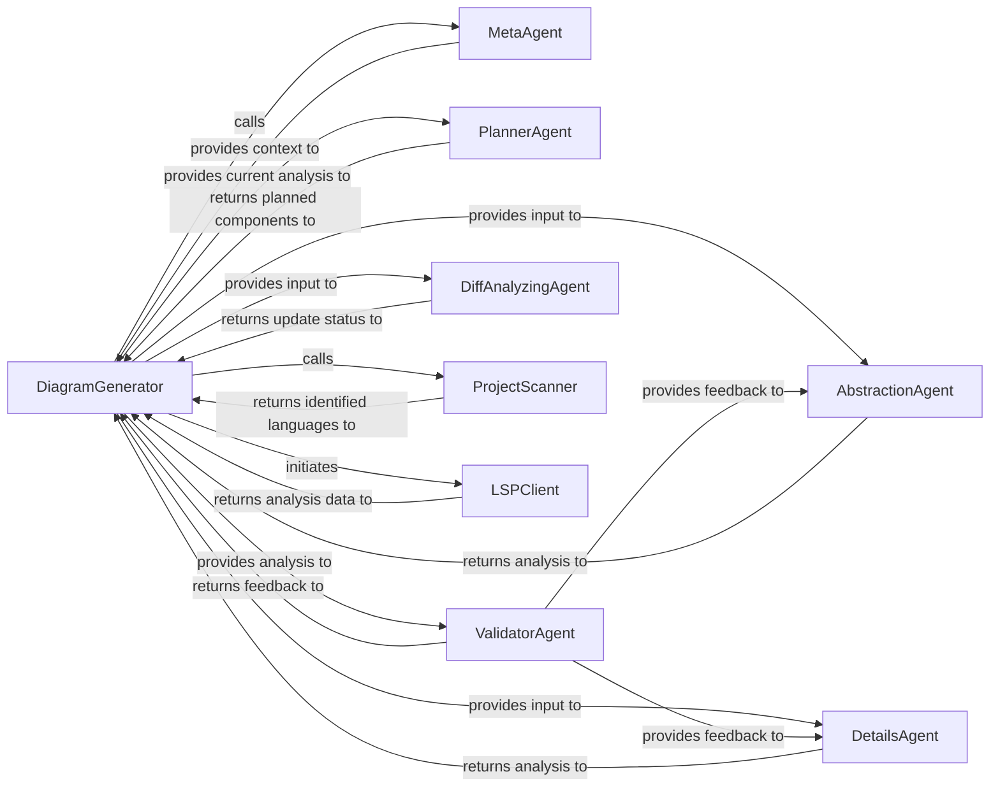

## Details

The `DiagramGenerator` orchestrates the entire analysis pipeline, starting with project abstraction and culminating in output generation. It leverages a `MetaAgent` for initial project context and a `DiffAnalyzingAgent` to determine if updates are needed. The `ProjectScanner` identifies programming languages, which then leads to the initiation of `LSPClient` instances. These `LSPClient` components are responsible for language-specific static analysis, building crucial structural data like call graphs and class hierarchies. The `AbstractionAgent` and `DetailsAgent` refine the codebase abstraction and perform in-depth component analysis, respectively, with feedback from the `ValidatorAgent`. A `PlannerAgent` guides the iterative exploration of the codebase. The `LSPClient` plays a foundational role by providing the raw structural data that informs the subsequent analysis stages.

### DiagramGenerator
The central orchestrator of the entire multi-level analysis pipeline. It initializes and manages the various agents, coordinates their execution, handles the flow of analysis data, and drives the overall process from initial project abstraction to output generation.

**Related Classes/Methods**:

- <a href="https://github.com/CodeBoarding/CodeBoarding/blob/main/diagram_analysis/diagram_generator.py#L25-L202" target="_blank" rel="noopener noreferrer">`DiagramGenerator`:25-202</a>

### MetaAgent
Responsible for performing the initial project abstraction by analyzing project metadata to generate high-level context for the subsequent detailed analysis.

**Related Classes/Methods**:

- <a href="https://github.com/CodeBoarding/CodeBoarding/blob/main/agents/meta_agent.py#L15-L37" target="_blank" rel="noopener noreferrer">`MetaAgent`:15-37</a>

### AbstractionAgent
Generates an initial, high-level abstraction of the entire codebase and refines this abstraction based on feedback from the `ValidatorAgent`.

**Related Classes/Methods**:

- <a href="https://github.com/CodeBoarding/CodeBoarding/blob/main/agents/abstraction_agent.py#L14-L100" target="_blank" rel="noopener noreferrer">`AbstractionAgent`:14-100</a>

### DetailsAgent
Performs in-depth analysis of individual components, including generating and analyzing control flow graphs (CFG), sub-CFG, and enhancing structural details. It also refines its analysis based on validation feedback.

**Related Classes/Methods**:

- <a href="https://github.com/CodeBoarding/CodeBoarding/blob/main/agents/details_agent.py#L16-L113" target="_blank" rel="noopener noreferrer">`DetailsAgent`:16-113</a>

### PlannerAgent
Determines the next set of components or areas of the codebase to be analyzed based on the current state of the analysis, enabling a multi-level and iterative exploration.

**Related Classes/Methods**:

- <a href="https://github.com/CodeBoarding/CodeBoarding/blob/main/agents/planner_agent.py#L13-L31" target="_blank" rel="noopener noreferrer">`PlannerAgent`:13-31</a>

### ValidatorAgent
Validates the correctness, completeness, and quality of the generated analysis at various stages, providing crucial feedback to the `AbstractionAgent` and `DetailsAgent` for refinement.

**Related Classes/Methods**:

- <a href="https://github.com/CodeBoarding/CodeBoarding/blob/main/agents/validator_agent.py#L15-L143" target="_blank" rel="noopener noreferrer">`ValidatorAgent`:15-143</a>

### DiffAnalyzingAgent
Checks for changes in the codebase or previous analysis results to determine if an update is needed and the scope of that update. It can retrieve existing analysis if no update is required.

**Related Classes/Methods**:

- <a href="https://github.com/CodeBoarding/CodeBoarding/blob/main/agents/diff_analyzer.py#L20-L136" target="_blank" rel="noopener noreferrer">`DiffAnalyzingAgent`:20-136</a>

### ProjectScanner [[Expand]](./ProjectScanner.md)
`ProjectScanner` identifies programming languages and initiates `LSP Clients`.

**Related Classes/Methods**:

- <a href="https://github.com/CodeBoarding/CodeBoarding/blob/main/static_analyzer/scanner.py#L13-L66" target="_blank" rel="noopener noreferrer">`ProjectScanner`:13-66</a>

### LSPClient [[Expand]](./LSPClient.md)
`LSPClient` performs language-specific static analysis, building call graphs, class hierarchies, and package dependencies, providing raw structural data.

**Related Classes/Methods**:

- <a href="https://github.com/CodeBoarding/CodeBoarding/blob/main/static_analyzer/lsp_client/client.py#L37-L923" target="_blank" rel="noopener noreferrer">`LSPClient`:37-923</a>

### [FAQ](https://github.com/CodeBoarding/GeneratedOnBoardings/tree/main?tab=readme-ov-file#faq)