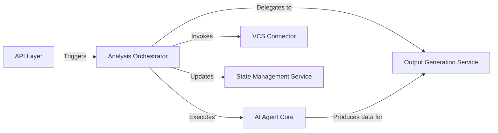

## Details

One paragraph explaining the functionality which is represented by this graph. What the main flow is and what is its purpose.

### API Layer
The primary entry point for the system. It exposes endpoints (e.g., via FastAPI) to receive analysis requests from users. Its sole responsibility is to validate incoming data, trigger the `Analysis Orchestrator`, and return a job identifier or the final result.

**Related Classes/Methods**:

- `local_app.py`

### Analysis Orchestrator
The central coordinator of the entire analysis workflow. It acts as the "brain" of the system, directing the sequence of operations from start to finish without performing the tasks itself. This component embodies the main analysis pipeline, initializing services and executing the analysis steps in order.

**Related Classes/Methods**:

- `code_analyzer/analyzer.py`

### AI Agent Core
Contains the core intelligence of the system. This component is a collection of specialized AI agents (likely built with LangChain/LangGraph) that execute the code analysis. It receives code context from the orchestrator and produces structured data (e.g., JSON) representing the analysis findings.

**Related Classes/Methods**:

- `agents/`

### VCS Connector
An abstraction layer for interacting with version control systems. Its responsibility is to handle the cloning and updating of code repositories, providing a clean interface (`clone_repo`, `pull_latest`) for the orchestrator to use.

**Related Classes/Methods**:

- `repo_utils/`

### State Management Service
Manages the lifecycle and persistence of each analysis job. Implemented as a repository pattern, it handles the storage and retrieval of analysis results and metadata, ensuring that job outputs are traceable and durable.

**Related Classes/Methods**:

- `code_analyzer/storage/local_storage.py`

### Output Generation Service [[Expand]](./Output_Generation_Service.md)
Responsible for transforming the structured data from the `AI Agent Core` into human-readable formats. By isolating this logic, new output types (e.g., PDF, JSON, HTML) can be added without modifying any other part of the system.

**Related Classes/Methods**:

- `output_generators/`

### [FAQ](https://github.com/CodeBoarding/GeneratedOnBoardings/tree/main?tab=readme-ov-file#faq)