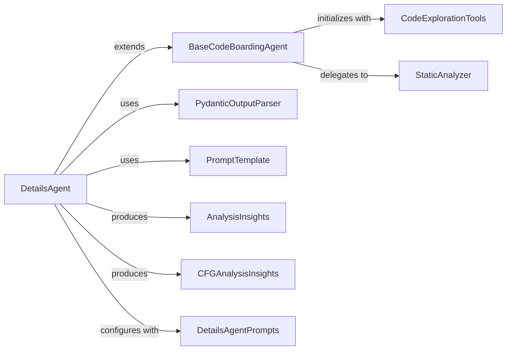

## Component Details

The Details Agent subsystem is designed to perform a comprehensive, multi-step analysis of code components. It orchestrates a series of operations, including generating and analyzing control flow graphs (CFG) and sub-CFGs, enhancing structural understanding, and conducting a final detailed code analysis. This process involves initializing and utilizing various prompt templates and output parsers to interact with a language model, processing its responses into structured insights, and ultimately refining these insights into a final documentation. The subsystem leverages foundational agent capabilities for tool invocation and response parsing, and integrates with external utilities for static code analysis and code exploration.

### DetailsAgent
The primary agent responsible for orchestrating the detailed, multi-step analysis of code components, including CFG, sub-CFG, structural enhancement, and final analysis.

**Related Classes/Methods**:

- <a href="https://github.com/CodeBoarding/CodeBoarding/blob/master/agents/details_agent.py#L12-L76" target="_blank" rel="noopener noreferrer">`CodeBoarding.agents.details_agent.DetailsAgent` (12:76)</a>
- <a href="https://github.com/CodeBoarding/CodeBoarding/blob/master/agents/details_agent.py#L13-L40" target="_blank" rel="noopener noreferrer">`CodeBoarding.agents.details_agent.DetailsAgent:__init__` (13:40)</a>
- <a href="https://github.com/CodeBoarding/CodeBoarding/blob/master/agents/details_agent.py#L42-L47" target="_blank" rel="noopener noreferrer">`CodeBoarding.agents.details_agent.DetailsAgent:step_subcfg` (42:47)</a>
- <a href="https://github.com/CodeBoarding/CodeBoarding/blob/master/agents/details_agent.py#L49-L56" target="_blank" rel="noopener noreferrer">`CodeBoarding.agents.details_agent.DetailsAgent:step_cfg` (49:56)</a>
- <a href="https://github.com/CodeBoarding/CodeBoarding/blob/master/agents/details_agent.py#L58-L67" target="_blank" rel="noopener noreferrer">`CodeBoarding.agents.details_agent.DetailsAgent:step_enhance_structure` (58:67)</a>
- <a href="https://github.com/CodeBoarding/CodeBoarding/blob/master/agents/details_agent.py#L69-L76" target="_blank" rel="noopener noreferrer">`CodeBoarding.agents.details_agent.DetailsAgent:step_analysis` (69:76)</a>

### BaseCodeBoardingAgent
The foundational agent providing core functionalities such as setting up environment variables, initializing code exploration tools, and handling the invocation and parsing of agent responses.

**Related Classes/Methods**:

- <a href="https://github.com/CodeBoarding/CodeBoarding/blob/master/agents/agent.py#L19-L89" target="_blank" rel="noopener noreferrer">`CodeBoarding.agents.agent.CodeBoardingAgent` (19:89)</a>
- <a href="https://github.com/CodeBoarding/CodeBoarding/blob/master/agents/agent.py#L20-L33" target="_blank" rel="noopener noreferrer">`CodeBoarding.agents.agent.CodeBoardingAgent:__init__` (20:33)</a>
- <a href="https://github.com/CodeBoarding/CodeBoarding/blob/master/agents/agent.py#L59-L66" target="_blank" rel="noopener noreferrer">`CodeBoarding.agents.agent.CodeBoardingAgent:_parse_invoke` (59:66)</a>
- <a href="https://github.com/CodeBoarding/CodeBoarding/blob/master/agents/agent.py#L68-L89" target="_blank" rel="noopener noreferrer">`CodeBoarding.agents.agent.CodeBoardingAgent:fix_source_code_reference_lines` (68:89)</a>

### PydanticOutputParser
A utility from langchain_core used for parsing language model outputs into structured Pydantic objects.

**Related Classes/Methods**:

- `langchain_core.output_parsers.PydanticOutputParser` (full file reference)

### PromptTemplate
A utility from langchain_core used for constructing dynamic prompts for language model interactions.

**Related Classes/Methods**:

- `langchain_core.prompts.PromptTemplate` (full file reference)

### AnalysisInsights
A Pydantic data model representing general analysis insights generated by the agents.

**Related Classes/Methods**:

- <a href="https://github.com/CodeBoarding/CodeBoarding/blob/master/agents/agent_responses.py#L54-L69" target="_blank" rel="noopener noreferrer">`CodeBoarding.agents.agent_responses.AnalysisInsights` (54:69)</a>

### CFGAnalysisInsights
A Pydantic data model specifically for insights derived from Control Flow Graph (CFG) analysis.

**Related Classes/Methods**:

- <a href="https://github.com/CodeBoarding/CodeBoarding/blob/master/agents/agent_responses.py#L89-L101" target="_blank" rel="noopener noreferrer">`CodeBoarding.agents.agent_responses.CFGAnalysisInsights` (89:101)</a>

### DetailsAgentPrompts
A collection of predefined prompt messages and templates specifically tailored for the various steps of the Details Agent's analysis process.

**Related Classes/Methods**:

- `CodeBoarding.agents.prompts.SYSTEM_DETAILS_MESSAGE` (full file reference)
- `CodeBoarding.agents.prompts.CFG_DETAILS_MESSAGE` (full file reference)
- `CodeBoarding.agents.prompts.DETAILS_MESSAGE` (full file reference)
- `CodeBoarding.agents.prompts.SUBCFG_DETAILS_MESSAGE` (full file reference)
- `CodeBoarding.agents.prompts.ENHANCE_STRUCTURE_MESSAGE` (full file reference)

### CodeExplorationTools
A set of specialized tools for exploring and extracting information from the codebase, including reading source code, analyzing package relationships, and understanding class/module structure.

**Related Classes/Methods**:

- <a href="https://github.com/CodeBoarding/CodeBoarding/blob/master/agents/tools/read_source.py#L19-L137" target="_blank" rel="noopener noreferrer">`CodeBoarding.agents.tools.read_source.CodeExplorerTool` (19:137)</a>
- <a href="https://github.com/CodeBoarding/CodeBoarding/blob/master/agents/tools/read_packages.py#L25-L74" target="_blank" rel="noopener noreferrer">`CodeBoarding.agents.tools.read_packages.PackageRelationsTool` (25:74)</a>
- <a href="https://github.com/CodeBoarding/CodeBoarding/blob/master/agents/tools/read_structure.py#L12-L58" target="_blank" rel="noopener noreferrer">`CodeBoarding.agents.tools.read_structure.CodeStructureTool` (12:58)</a>

### StaticAnalyzer
A component responsible for static analysis of code, particularly for identifying line locations of fully qualified names (FQNs) within source files.

**Related Classes/Methods**:

- <a href="https://github.com/CodeBoarding/CodeBoarding/blob/master/static_analyzer/reference_lines.py#L4-L52" target="_blank" rel="noopener noreferrer">`CodeBoarding.static_analyzer.reference_lines:find_fqn_location` (4:52)</a>

### [FAQ](https://github.com/CodeBoarding/GeneratedOnBoardings/tree/main?tab=readme-ov-file#faq)