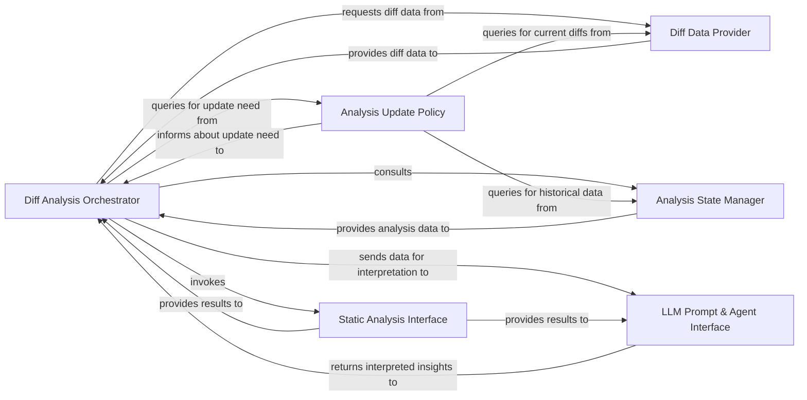

## Details

The `Diff Analyzer` subsystem is responsible for identifying and processing code changes (diffs) to optimize the analysis scope and efficiency of the codebase analysis tool. Its core functionality revolves around determining what has changed, whether a re-analysis is needed, and orchestrating the subsequent analysis steps for modified code. It is primarily encapsulated within the `agents/diff_analyzer.py` file.

### Diff Analysis Orchestrator
This is the central control component for the diff analysis workflow. It initiates the process, coordinates the retrieval of diff data, consults the analysis state, applies update policies, and integrates with static analysis and LLM interpretation components. It embodies the "Pipeline/Orchestration" pattern, driving the analysis.

**Related Classes/Methods**:

- <a href="https://github.com/CodeBoarding/CodeBoarding/blob/main/agents/diff_analyzer.py#L20-L136" target="_blank" rel="noopener noreferrer">`agents.diff_analyzer.DiffAnalyzingAgent`:20-136</a>

### Diff Data Provider
Responsible for extracting raw diff information from the version control system (e.g., Git) and performing initial filtering to identify relevant changes. This component is a foundational input for the analysis.

**Related Classes/Methods**:

- <a href="https://github.com/CodeBoarding/CodeBoarding/blob/main/agents/diff_analyzer.py#L43-L56" target="_blank" rel="noopener noreferrer">`agents.diff_analyzer.get_diff_data`:43-56</a>
- <a href="https://github.com/CodeBoarding/CodeBoarding/blob/main/agents/diff_analyzer.py#L58-L69" target="_blank" rel="noopener noreferrer">`agents.diff_analyzer.filter_diff`:58-69</a>

### Analysis State Manager
Manages the persistence and retrieval of previously generated analysis results for both the overall project and individual components. It determines if an analysis already exists, enabling efficient incremental updates. This aligns with the "Job Database" and "Configuration Management" aspects.

**Related Classes/Methods**:

- <a href="https://github.com/CodeBoarding/CodeBoarding/blob/main/agents/diff_analyzer.py#L71-L79" target="_blank" rel="noopener noreferrer">`agents.diff_analyzer.analysis_exists`:71-79</a>
- <a href="https://github.com/CodeBoarding/CodeBoarding/blob/main/agents/diff_analyzer.py#L34-L41" target="_blank" rel="noopener noreferrer">`agents.diff_analyzer.get_analysis`:34-41</a>
- <a href="https://github.com/CodeBoarding/CodeBoarding/blob/main/agents/diff_analyzer.py#L81-L83" target="_blank" rel="noopener noreferrer">`agents.diff_analyzer.component_exists`:81-83</a>
- <a href="https://github.com/CodeBoarding/CodeBoarding/blob/main/agents/diff_analyzer.py#L103-L110" target="_blank" rel="noopener noreferrer">`agents.diff_analyzer.get_component_analysis`:103-110</a>
- <a href="https://github.com/CodeBoarding/CodeBoarding/blob/main/agents/diff_analyzer.py" target="_blank" rel="noopener noreferrer">`agents.diff_analyzer.analysis_file`</a>
- <a href="https://github.com/CodeBoarding/CodeBoarding/blob/main/agents/diff_analyzer.py" target="_blank" rel="noopener noreferrer">`agents.diff_analyzer.component_file`</a>

### Analysis Update Policy
Encapsulates the logic for deciding whether a new analysis is required. It compares current diff data from the `Diff Data Provider` with existing analysis states from the `Analysis State Manager` to prevent redundant processing.

**Related Classes/Methods**:

- <a href="https://github.com/CodeBoarding/CodeBoarding/blob/main/agents/diff_analyzer.py#L85-L101" target="_blank" rel="noopener noreferrer">`agents.diff_analyzer.check_for_updates`:85-101</a>
- <a href="https://github.com/CodeBoarding/CodeBoarding/blob/main/agents/diff_analyzer.py#L112-L136" target="_blank" rel="noopener noreferrer">`agents.diff_analyzer.check_for_component_updates`:112-136</a>

### Static Analysis Interface
Provides a standardized way to interact with external static analysis tools. It gathers deeper insights into the code changes identified by the diff analysis, enriching the context for LLM interpretation. This component is part of the "Static Analysis Engine."

**Related Classes/Methods**:

- <a href="https://github.com/CodeBoarding/CodeBoarding/blob/main/agents/diff_analyzer.py" target="_blank" rel="noopener noreferrer">`agents.diff_analyzer.static_analysis`</a>

### LLM Prompt & Agent Interface
Constructs prompts based on the diff analysis and static analysis results, then interacts with Large Language Model (LLM) agents to interpret code changes and generate insights. This is a key part of the "AI Interpretation Layer" and the project's AI-centric approach.

**Related Classes/Methods**:

- <a href="https://github.com/CodeBoarding/CodeBoarding/blob/main/agents/diff_analyzer.py" target="_blank" rel="noopener noreferrer">`agents.diff_analyzer.prompt`</a>
- <a href="https://github.com/CodeBoarding/CodeBoarding/blob/main/agents/diff_analyzer.py" target="_blank" rel="noopener noreferrer">`agents.diff_analyzer.agent`</a>

### [FAQ](https://github.com/CodeBoarding/GeneratedOnBoardings/tree/main?tab=readme-ov-file#faq)