```mermaid
graph LR
    API_Service["API Service"]
    Repository_Manager["Repository Manager"]
    Orchestration_Engine["Orchestration Engine"]
    Static_Analysis_Engine["Static Analysis Engine"]
    FileAnalysisResult["FileAnalysisResult"]
    AI_Interpretation_Layer["AI Interpretation Layer"]
    Output_Generation_Engine["Output Generation Engine"]
    API_Service -- "initiates analysis workflows in" --> Orchestration_Engine
    Repository_Manager -- "provides source code to" --> Static_Analysis_Engine
    Orchestration_Engine -- "requests code from" --> Repository_Manager
    Orchestration_Engine -- "dispatches files to" --> Static_Analysis_Engine
    Orchestration_Engine -- "sends analysis results to" --> AI_Interpretation_Layer
    Orchestration_Engine -- "triggers documentation generation in" --> Output_Generation_Engine
    Static_Analysis_Engine -- "produces" --> FileAnalysisResult
    FileAnalysisResult -- "is consumed by" --> AI_Interpretation_Layer
    AI_Interpretation_Layer -- "returns interpreted results to" --> Orchestration_Engine
    click API_Service href "https://github.com/CodeBoarding/GeneratedOnBoardings/blob/main/CodeBoarding/API_Service.md" "Details"
    click Repository_Manager href "https://github.com/CodeBoarding/GeneratedOnBoardings/blob/main/CodeBoarding/Repository_Manager.md" "Details"
    click Orchestration_Engine href "https://github.com/CodeBoarding/GeneratedOnBoardings/blob/main/CodeBoarding/Orchestration_Engine.md" "Details"
    click Static_Analysis_Engine href "https://github.com/CodeBoarding/GeneratedOnBoardings/blob/main/CodeBoarding/Static_Analysis_Engine.md" "Details"
    click FileAnalysisResult href "https://github.com/CodeBoarding/GeneratedOnBoardings/blob/main/CodeBoarding/FileAnalysisResult.md" "Details"
    click AI_Interpretation_Layer href "https://github.com/CodeBoarding/GeneratedOnBoardings/blob/main/CodeBoarding/AI_Interpretation_Layer.md" "Details"
    click Output_Generation_Engine href "https://github.com/CodeBoarding/GeneratedOnBoardings/blob/main/CodeBoarding/Output_Generation_Engine.md" "Details"
```

## Details

The system is designed to generate documentation and diagrams from source code repositories. It operates through a pipeline initiated by an API Service that receives requests. The Orchestration Engine then coordinates the entire analysis workflow, leveraging a Repository Manager to fetch code, a Static Analysis Engine for structural code analysis, and an AI Interpretation Layer to derive high-level insights. Finally, the Output Generation Engine formats these insights into user-consumable documentation and diagrams.

### API Service [[Expand]](./API_Service.md)
The external interface of the tool, responsible for receiving analysis requests from users or integrated systems and returning the generated documentation or status. It acts as the entry point for all external interactions.

**Related Classes/Methods**:

- <a href="https://github.com/CodeBoarding/CodeBoarding/blob/main/local_app.py" target="_blank" rel="noopener noreferrer">`local_app.py`</a>

### Repository Manager [[Expand]](./Repository_Manager.md)
Handles the fetching, cloning, and management of source code repositories. It abstracts the details of interacting with various version control systems (e.g., Git) to provide the raw code files for analysis.

**Related Classes/Methods**:

- <a href="https://github.com/CodeBoarding/CodeBoarding/blob/main/repo_utils" target="_blank" rel="noopener noreferrer">`repo_utils`</a>

### Orchestration Engine [[Expand]](./Orchestration_Engine.md)
The central coordinator of the entire analysis pipeline. It manages the workflow, dispatches tasks to other components (e.g., static analysis, AI interpretation, output generation), and ensures the correct sequence and flow of data.

**Related Classes/Methods**:

- <a href="https://github.com/CodeBoarding/CodeBoarding/blob/main/diagram_analysis/diagram_generator.py#L25-L202" target="_blank" rel="noopener noreferrer">`diagram_analysis.diagram_generator.DiagramGenerator`:25-202</a>

### Static Analysis Engine [[Expand]](./Static_Analysis_Engine.md)
A dedicated subsystem responsible for performing in-depth static analysis on individual source files. It extracts structural information such as imports, symbols (functions, classes), call graphs, and class hierarchies.

**Related Classes/Methods**:

- <a href="https://github.com/CodeBoarding/CodeBoarding/blob/main/static_analyzer/scanner.py#L13-L66" target="_blank" rel="noopener noreferrer">`static_analyzer.scanner.ProjectScanner`:13-66</a>

### FileAnalysisResult [[Expand]](./FileAnalysisResult.md)
A foundational data structure within the Static Analysis Engine, encapsulating the comprehensive static analysis results for a single source file. It serves as the structured output of the static analysis phase, containing extracted information such as imports, symbols, call relationships, and class hierarchies.

**Related Classes/Methods**:

- <a href="https://github.com/CodeBoarding/CodeBoarding/blob/main/static_analyzer/lsp_client/client.py#L22-L34" target="_blank" rel="noopener noreferrer">`FileAnalysisResult`:22-34</a>

### AI Interpretation Layer [[Expand]](./AI_Interpretation_Layer.md)
Leverages Large Language Models (LLMs) to interpret, abstract, and enrich the raw static analysis results. This layer transforms low-level code insights into higher-level architectural understanding, component descriptions, and interaction summaries.

**Related Classes/Methods**:

- <a href="https://github.com/CodeBoarding/CodeBoarding/blob/main/agents/abstraction_agent.py#L14-L100" target="_blank" rel="noopener noreferrer">`agents.abstraction_agent.AbstractionAgent`:14-100</a>

### Output Generation Engine [[Expand]](./Output_Generation_Engine.md)
Responsible for formatting and generating the final documentation, diagrams (e.g., Mermaid.js), and other output artifacts based on the interpreted analysis results. It transforms the processed data into user-consumable formats.

**Related Classes/Methods**:

- <a href="https://github.com/CodeBoarding/CodeBoarding/blob/main/output_generators" target="_blank" rel="noopener noreferrer">`output_generators`</a>

### [FAQ](https://github.com/CodeBoarding/GeneratedOnBoardings/tree/main?tab=readme-ov-file#faq)