```mermaid
graph LR
    Repository_Manager["Repository Manager"]
    Git_Diff_Extractor["Git Diff Extractor"]
    FileChange["FileChange"]
    AI_Interpretation_Layer["AI Interpretation Layer"]
    Repository_Manager -- "provides repository context to" --> Git_Diff_Extractor
    Git_Diff_Extractor -- "creates and populates" --> FileChange
    Git_Diff_Extractor -- "provides processed diffs to" --> Repository_Manager
    FileChange -- "provides structured input to" --> AI_Interpretation_Layer
    click Repository_Manager href "https://github.com/CodeBoarding/GeneratedOnBoardings/blob/main/CodeBoarding/Repository_Manager.md" "Details"
    click Git_Diff_Extractor href "https://github.com/CodeBoarding/GeneratedOnBoardings/blob/main/CodeBoarding/Git_Diff_Extractor.md" "Details"
    click AI_Interpretation_Layer href "https://github.com/CodeBoarding/GeneratedOnBoardings/blob/main/CodeBoarding/AI_Interpretation_Layer.md" "Details"
```

## Details

This subsystem focuses on the extraction and initial structuring of Git diff information, bridging the gap between raw repository data and the AI-driven interpretation process. It encompasses components responsible for repository interaction, diff generation, and the representation of file changes, ultimately preparing this data for advanced analysis.

### Repository Manager [[Expand]](./Repository_Manager.md)
The `Repository Manager` acts as the central orchestrator for all source code repository interactions. It provides a unified interface for the system to access repository functionalities, including providing repository context and receiving processed diff information.

**Related Classes/Methods**:

- <a href="https://github.com/CodeBoarding/CodeBoarding/blob/main/repo_utils" target="_blank" rel="noopener noreferrer">`repo_utils`</a>
- <a href="https://github.com/CodeBoarding/CodeBoarding/blob/main/repo_utils/git_diff.py" target="_blank" rel="noopener noreferrer">`repo_utils.git_diff`</a>

### Git Diff Extractor [[Expand]](./Git_Diff_Extractor.md)
This component orchestrates the entire diff extraction process. It interacts with the `Repository Manager` to obtain repository context, executes Git commands to generate raw diffs, and then parses these outputs. Its primary responsibility is to transform raw Git diff data into structured `FileChange` objects, detailing additions, deletions, and modifications at the file and line level.

**Related Classes/Methods**:

- <a href="https://github.com/CodeBoarding/CodeBoarding/blob/main/repo_utils/git_diff.py" target="_blank" rel="noopener noreferrer">`repo_utils.git_diff.git_diff`</a>
- <a href="https://github.com/CodeBoarding/CodeBoarding/blob/main/repo_utils/git_diff.py#L9-L24" target="_blank" rel="noopener noreferrer">`repo_utils.git_diff.FileChange`:9-24</a>

### FileChange
This is a data transfer object (DTO) that encapsulates the structured output of the diff extraction for a single file. It holds all relevant details of a file's changes, including the file path, type of change (added, modified, deleted), and specific line-level modifications. It also provides a standardized format, including a method (`llm_str`) specifically designed for consumption by the `AI Interpretation Layer`.

**Related Classes/Methods**:

- <a href="https://github.com/CodeBoarding/CodeBoarding/blob/main/repo_utils/git_diff.py#L9-L24" target="_blank" rel="noopener noreferrer">`repo_utils.git_diff.FileChange`:9-24</a>

### AI Interpretation Layer [[Expand]](./AI_Interpretation_Layer.md)
This layer represents a multi-agent architecture responsible for interpreting structured input, such as `FileChange` objects, to derive architectural insights. It contains specialized agents like the `Diff Analyzer` that process code changes.

**Related Classes/Methods**:

- <a href="https://github.com/CodeBoarding/CodeBoarding/blob/main/agents/meta_agent.py" target="_blank" rel="noopener noreferrer">`agents.meta_agent`</a>
- <a href="https://github.com/CodeBoarding/CodeBoarding/blob/main/agents/planner_agent.py" target="_blank" rel="noopener noreferrer">`agents.planner_agent`</a>
- <a href="https://github.com/CodeBoarding/CodeBoarding/blob/main/agents/diff_analyzer.py" target="_blank" rel="noopener noreferrer">`agents.diff_analyzer`</a>
- <a href="https://github.com/CodeBoarding/CodeBoarding/blob/main/agents/details_agent.py" target="_blank" rel="noopener noreferrer">`agents.details_agent`</a>
- <a href="https://github.com/CodeBoarding/CodeBoarding/blob/main/agents/abstraction_agent.py" target="_blank" rel="noopener noreferrer">`agents.abstraction_agent`</a>
- <a href="https://github.com/CodeBoarding/CodeBoarding/blob/main/agents/validator_agent.py" target="_blank" rel="noopener noreferrer">`agents.validator_agent`</a>
- <a href="https://github.com/CodeBoarding/CodeBoarding/blob/main/agents/agent.py#L27-L207" target="_blank" rel="noopener noreferrer">`agents.agent.CodeBoardingAgent`:27-207</a>

### [FAQ](https://github.com/CodeBoarding/GeneratedOnBoardings/tree/main?tab=readme-ov-file#faq)