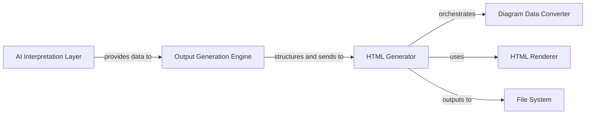

## Details

The system's core functionality revolves around generating comprehensive architectural documentation and interactive diagrams from a codebase. The AI Interpretation Layer, composed of various specialized agents (e.g., AbstractionAgent), performs the initial code analysis to extract raw architectural insights. These insights are then fed into the Output Generation Engine (DiagramGenerator), which orchestrates the entire output process. The Output Generation Engine structures the interpreted data, utilizing the Diagram Data Converter (from_analysis_to_json) to prepare data for visual representation. Subsequently, the HTML Generator (HTMLGenerator) takes this processed data, applies templates from the HTML Renderer (html_template module), and constructs the final HTML output. Finally, all generated documentation and diagram assets are persistently stored in the File System. This flow ensures a clear, traceable path from raw code analysis to user-consumable architectural documentation.

### HTML Generator [[Expand]](./HTML_Generator.md)
The primary component orchestrating the generation of all HTML-based outputs, including interactive diagrams and static HTML documentation. It receives structured architectural insights and converts them into a format suitable for web presentation, applying HTML templates to generate complete, standalone HTML files.

**Related Classes/Methods**:

- <a href="https://github.com/CodeBoarding/CodeBoarding/blob/main/" target="_blank" rel="noopener noreferrer">`output_generators.html.HTMLGenerator`</a>

### Diagram Data Converter
Responsible for transforming internal architectural graph data into formats compatible with interactive diagram libraries (e.g., Cytoscape.js compatible JSON). This component ensures that complex architectural relationships can be visualized dynamically.

**Related Classes/Methods**:

- <a href="https://github.com/CodeBoarding/CodeBoarding/blob/main/diagram_analysis/analysis_json.py#L25-L32" target="_blank" rel="noopener noreferrer">`diagram_analysis.analysis_json.from_analysis_to_json`:25-32</a>

### HTML Renderer
Handles the application of HTML templates and data to produce the final HTML structure. It embeds the converted diagram data and other architectural details into the web page, ensuring a consistent and presentable output.

**Related Classes/Methods**:

- <a href="https://github.com/CodeBoarding/CodeBoarding/blob/main/" target="_blank" rel="noopener noreferrer">`output_generators.html_template`</a>

### Output Generation Engine [[Expand]](./Output_Generation_Engine.md)
An intermediary component that receives processed data from the `AI Interpretation Layer` and provides structured architectural insights to the `HTML Generator`. It acts as the direct data source for the HTML generation process, coordinating the overall analysis and output flow.

**Related Classes/Methods**:

- <a href="https://github.com/CodeBoarding/CodeBoarding/blob/main/diagram_analysis/diagram_generator.py#L25-L202" target="_blank" rel="noopener noreferrer">`diagram_analysis.diagram_generator.DiagramGenerator`:25-202</a>

### AI Interpretation Layer [[Expand]](./AI_Interpretation_Layer.md)
Generates the core architectural insights and data from code analysis, leveraging AI/ML models. This layer provides the raw, interpreted data that the `Output Generation Engine` then structures for documentation, encompassing various agents for abstraction, detail extraction, planning, and validation.

**Related Classes/Methods**:

- <a href="https://github.com/CodeBoarding/CodeBoarding/blob/main/agents/abstraction_agent.py#L14-L100" target="_blank" rel="noopener noreferrer">`agents.abstraction_agent.AbstractionAgent`:14-100</a>

### File System
The destination for the generated HTML documentation and related assets. It provides persistent storage for the final output, making it accessible for users or further deployment, managed through standard file operations.

**Related Classes/Methods**:

- <a href="https://github.com/CodeBoarding/CodeBoarding/blob/main/logging_config.py#L5-L72" target="_blank" rel="noopener noreferrer">``:5-72</a>

### [FAQ](https://github.com/CodeBoarding/GeneratedOnBoardings/tree/main?tab=readme-ov-file#faq)