```mermaid
graph LR
    API_Service["API Service"]
    Orchestration_Engine["Orchestration Engine"]
    Repository_Manager["Repository Manager"]
    Static_Analysis_Engine["Static Analysis Engine"]
    AI_Interpretation_Layer["AI Interpretation Layer"]
    Output_Generation_Engine["Output Generation Engine"]
    Job_Database["Job Database"]
    Configuration_Management["Configuration Management"]
    HTML_Template_Populator["HTML Template Populator"]
    API_Service -- "initiates" --> Orchestration_Engine
    Orchestration_Engine -- "manages" --> Repository_Manager
    Orchestration_Engine -- "manages" --> Static_Analysis_Engine
    Orchestration_Engine -- "manages" --> AI_Interpretation_Layer
    Orchestration_Engine -- "manages" --> Output_Generation_Engine
    Repository_Manager -- "provides code to" --> Static_Analysis_Engine
    Static_Analysis_Engine -- "sends results to" --> AI_Interpretation_Layer
    AI_Interpretation_Layer -- "sends interpreted data to" --> Output_Generation_Engine
    Output_Generation_Engine -- "contains" --> HTML_Template_Populator
    Output_Generation_Engine -- "updates status and results in" --> Job_Database
    Configuration_Management -- "provides configurations to" --> API_Service
    Configuration_Management -- "provides configurations to" --> AI_Interpretation_Layer
    Orchestration_Engine -- "retrieves from" --> Job_Database
    click API_Service href "https://github.com/CodeBoarding/GeneratedOnBoardings/blob/main/CodeBoarding/API_Service.md" "Details"
    click Orchestration_Engine href "https://github.com/CodeBoarding/GeneratedOnBoardings/blob/main/CodeBoarding/Orchestration_Engine.md" "Details"
    click Repository_Manager href "https://github.com/CodeBoarding/GeneratedOnBoardings/blob/main/CodeBoarding/Repository_Manager.md" "Details"
    click Static_Analysis_Engine href "https://github.com/CodeBoarding/GeneratedOnBoardings/blob/main/CodeBoarding/Static_Analysis_Engine.md" "Details"
    click AI_Interpretation_Layer href "https://github.com/CodeBoarding/GeneratedOnBoardings/blob/main/CodeBoarding/AI_Interpretation_Layer.md" "Details"
    click Output_Generation_Engine href "https://github.com/CodeBoarding/GeneratedOnBoardings/blob/main/CodeBoarding/Output_Generation_Engine.md" "Details"
    click HTML_Template_Populator href "https://github.com/CodeBoarding/GeneratedOnBoardings/blob/main/CodeBoarding/HTML_Template_Populator.md" "Details"
```

## Details

The CodeBoarding system is designed to analyze codebases and generate comprehensive architectural documentation, including interactive diagrams. The process begins with an `API Service` that acts as the primary interface, receiving requests and initiating the analysis workflow. The `Orchestration Engine` then takes charge, coordinating various specialized agents to perform static analysis, interpret results using AI, and generate diverse output formats. The `Repository Manager` ensures the codebase is accessible for analysis, while the `Static Analysis Engine` extracts structural information. The `AI Interpretation Layer` leverages Large Language Models to transform raw analysis into high-level insights. Finally, the `Output Generation Engine`, with its `HTML Template Populator`, assembles these insights into user-friendly HTML documentation and interactive diagrams. Throughout this process, `Configuration Management` provides necessary settings, and the `Job Database` maintains the state and results of ongoing analyses.

### API Service [[Expand]](./API_Service.md)
Manages external interactions, exposes the tool's functionalities, and serves as the primary interface for users or other systems, particularly in handling requests and orchestrating initial agent calls.

**Related Classes/Methods**:

- <a href="https://github.com/CodeBoarding/CodeBoarding/blob/main/agents/agent.py#L27-L207" target="_blank" rel="noopener noreferrer">`CodeBoardingAgent`:27-207</a>

### Orchestration Engine [[Expand]](./Orchestration_Engine.md)
Coordinates the overall workflow of codebase analysis and documentation generation, managing the sequence and execution of tasks across different components, including the various agents.

**Related Classes/Methods**:

- <a href="https://github.com/CodeBoarding/CodeBoarding/blob/main/diagram_analysis/diagram_generator.py#L25-L202" target="_blank" rel="noopener noreferrer">`DiagramGenerator`:25-202</a>

### Repository Manager [[Expand]](./Repository_Manager.md)
Handles interactions with various code repositories (e.g., Git), including cloning, fetching, and managing local copies of codebases for analysis.

**Related Classes/Methods**:

- <a href="https://github.com/CodeBoarding/CodeBoarding/blob/main/repo_utils/git_diff.py#L1-L120" target="_blank" rel="noopener noreferrer">`repo_utils`:1-120</a>

### Static Analysis Engine [[Expand]](./Static_Analysis_Engine.md)
Performs static code analysis on the retrieved codebases, extracting structural information, dependencies, and other relevant metadata without executing the code.

**Related Classes/Methods**:

- <a href="https://github.com/CodeBoarding/CodeBoarding/blob/main/static_analyzer/scanner.py#L13-L66" target="_blank" rel="noopener noreferrer">`ProjectScanner`:13-66</a>

### AI Interpretation Layer [[Expand]](./AI_Interpretation_Layer.md)
Interprets the raw analysis results from the Static Analysis Engine using Large Language Models (LLMs), abstracting code structures and generating high-level insights suitable for documentation.

**Related Classes/Methods**:

- <a href="https://github.com/CodeBoarding/CodeBoarding/blob/main/agents/abstraction_agent.py#L14-L100" target="_blank" rel="noopener noreferrer">`AbstractionAgent`:14-100</a>

### Output Generation Engine [[Expand]](./Output_Generation_Engine.md)
Transforms the AI-interpreted insights into various documentation formats, including interactive diagrams (e.g., Mermaid.js), markdown files, and structured HTML. This engine specifically integrates generated architectural data (like Cytoscape JSON and component-specific HTML snippets) into predefined HTML templates to produce the final, complete, and styled HTML output.

**Related Classes/Methods**:

- <a href="https://github.com/CodeBoarding/CodeBoarding/blob/main/diagram_analysis/analysis_json.py#L25-L32" target="_blank" rel="noopener noreferrer">`from_analysis_to_json`:25-32</a>

### Job Database
Stores information about analysis jobs, their current status, progress, and results, providing persistence and traceability for ongoing and completed tasks, primarily through the serialization of analysis insights.

**Related Classes/Methods**:

- <a href="https://github.com/CodeBoarding/CodeBoarding/blob/main/diagram_analysis/analysis_json.py#L15-L22" target="_blank" rel="noopener noreferrer">`AnalysisInsightsJson`:15-22</a>

### Configuration Management
Manages system configurations, parameters, and credentials, ensuring that all components operate with the correct settings and can adapt to different environments or LLM providers.

**Related Classes/Methods**:

- <a href="https://github.com/CodeBoarding/CodeBoarding/blob/main/agents/agent.py#L48-L57" target="_blank" rel="noopener noreferrer">`_setup_env_vars`:48-57</a>

### HTML Template Populator [[Expand]](./HTML_Template_Populator.md)
A critical internal component of the Output Generation Engine. Its specific responsibility is to take the various generated data artifacts (e.g., Cytoscape JSON for diagrams, component-specific HTML snippets) and dynamically embed them into a base HTML template. This process ensures that the final output is a cohesive, styled, and interactive HTML document, ready for consumption. It acts as the final assembly stage for the HTML-based documentation within the Output Generation Engine.

**Related Classes/Methods**:

- <a href="https://github.com/CodeBoarding/CodeBoarding/blob/main/output_generators/html_template.py#L6-L341" target="_blank" rel="noopener noreferrer">`populate_html_template`:6-341</a>

### [FAQ](https://github.com/CodeBoarding/GeneratedOnBoardings/tree/main?tab=readme-ov-file#faq)