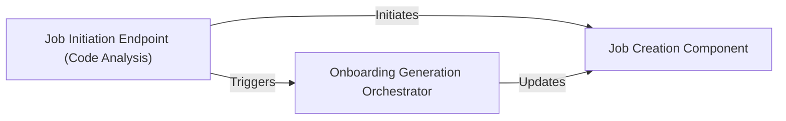

## Details

The system's core functionality revolves around a FastAPI application (`local_app.py`) that exposes an API endpoint for initiating code analysis and documentation generation jobs. This `Job Initiation Endpoint` is responsible for validating incoming requests and then delegating to a `Job Creation Component` to set up and persist the job's initial state. Concurrently, an `Onboarding Generation Orchestrator` is triggered as a background task, which then manages the end-to-end workflow, including repository handling, static analysis, and result generation, continuously updating the job's status through the `Job Creation Component`. This architecture ensures asynchronous processing of potentially long-running documentation generation tasks, providing a responsive user experience while maintaining job state persistence.

### Job Initiation Endpoint (Code Analysis) [[Expand]](./Job_Initiation_Endpoint_Code_Analysis_.md)
Serves as the primary external interface, receiving client requests to initiate a code analysis and documentation generation job. It validates input parameters and delegates the initial job setup and orchestration triggering. This component embodies the "API Service" pattern.

**Related Classes/Methods**:

- <a href="https://github.com/CodeBoarding/CodeBoarding/blob/main/local_app.py#L133-L150" target="_blank" rel="noopener noreferrer">`local_app.start_generation_job`:133-150</a>

### Job Creation Component
Responsible for the initial setup and persistence of a new code analysis job. This involves creating a record in a job database, assigning a unique ID, and setting the initial status, aligning with the "Job Database" and "Configuration Management" patterns.

**Related Classes/Methods**:

- <a href="https://github.com/CodeBoarding/CodeBoarding/blob/main/local_app.py#L77-L89" target="_blank" rel="noopener noreferrer">`local_app.make_job`:77-89</a>
- <a href="https://github.com/CodeBoarding/CodeBoarding/blob/main/duckdb_crud.py#L48-L58" target="_blank" rel="noopener noreferrer">`duckdb_crud.insert_job`:48-58</a>

### Onboarding Generation Orchestrator
Manages and coordinates the overall workflow of the code analysis and documentation generation process. It triggers subsequent stages, such as repository cloning, static analysis, AI interpretation, and output generation, embodying the "Orchestration Engine" pattern.

**Related Classes/Methods**:

- <a href="https://github.com/CodeBoarding/CodeBoarding/blob/main/local_app.py#L92-L129" target="_blank" rel="noopener noreferrer">`local_app.generate_onboarding`:92-129</a>

### [FAQ](https://github.com/CodeBoarding/GeneratedOnBoardings/tree/main?tab=readme-ov-file#faq)