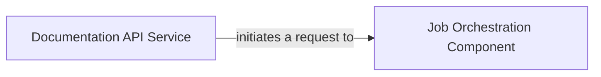

## Details

The `Job Initiation Endpoint (Documentation Only)` subsystem is primarily concerned with the initial reception and processing of requests to generate documentation. It acts as the external interface for this specific functionality and the immediate internal component responsible for setting up the documentation job.

### Documentation API Service
This component serves as the external entry point for all documentation generation requests. It is responsible for receiving incoming requests, parsing their parameters, and performing initial validation. Specifically, the `Job Initiation Endpoint` is a key part of this service, managing requests for focused documentation generation.

**Related Classes/Methods**:

- <a href="https://github.com/CodeBoarding/CodeBoarding/blob/main/local_app.py#L181-L231" target="_blank" rel="noopener noreferrer">`local_app.start_docs_generation_job`:181-231</a>

### Job Orchestration Component
This component is responsible for the initial setup and management of documentation generation jobs. Upon receiving a request from the `Documentation API Service`, it creates a new job, registers it within the system, and sets its initial state, preparing it for subsequent processing stages in the overall pipeline.

**Related Classes/Methods**:

- <a href="https://github.com/CodeBoarding/CodeBoarding/blob/main/local_app.py#L77-L89" target="_blank" rel="noopener noreferrer">`local_app.make_job`:77-89</a>

### [FAQ](https://github.com/CodeBoarding/GeneratedOnBoardings/tree/main?tab=readme-ov-file#faq)