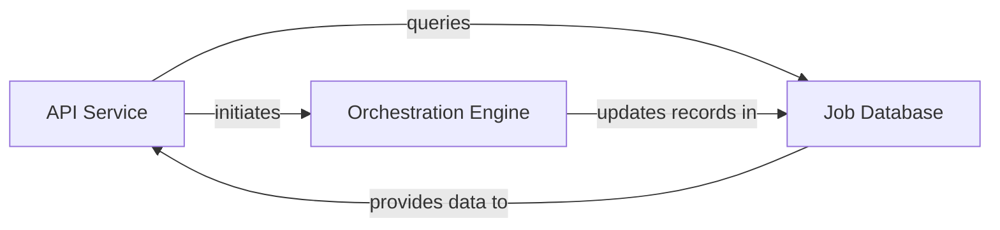

## Details

The system is structured around three core components: the `API Service`, the `Job Database`, and the `Orchestration Engine`. The `API Service` acts as the primary interface, handling all incoming requests for job creation and status retrieval. It interacts with the `Job Database` to fetch and display job information. The `Orchestration Engine` is responsible for the execution and management of background jobs, continuously updating the `Job Database` with the latest job statuses and results. The `API Service` initiates jobs, which are then managed by the `Orchestration Engine`, ensuring a clear separation of concerns between external interaction, data persistence, and job processing.

### API Service [[Expand]](./API_Service.md)
This component serves as the external interface for the system, exposing endpoints like `list_jobs`, `start_generation_job`, `get_job`, `start_docs_generation_job`, and `get_github_action_status`. It is responsible for receiving client requests, orchestrating the retrieval or creation of job data, and formatting responses. It acts as the gateway for all job-related queries and initiation.

**Related Classes/Methods**:

- <a href="https://github.com/CodeBoarding/CodeBoarding/blob/main/local_app.py#L282-L311" target="_blank" rel="noopener noreferrer">`local_app.list_jobs`:282-311</a>
- <a href="https://github.com/CodeBoarding/CodeBoarding/blob/main/local_app.py#L133-L150" target="_blank" rel="noopener noreferrer">`local_app.start_generation_job`:133-150</a>
- <a href="https://github.com/CodeBoarding/CodeBoarding/blob/main/local_app.py#L161-L170" target="_blank" rel="noopener noreferrer">`local_app.get_job`:161-170</a>
- <a href="https://github.com/CodeBoarding/CodeBoarding/blob/main/local_app.py#L181-L231" target="_blank" rel="noopener noreferrer">`local_app.start_docs_generation_job`:181-231</a>
- <a href="https://github.com/CodeBoarding/CodeBoarding/blob/main/local_app.py#L234-L279" target="_blank" rel="noopener noreferrer">`local_app.get_github_action_status`:234-279</a>

### Job Database
The `Job Database` is the persistent and authoritative storage for all job-related metadata, including their current status, progress, and historical records. It ensures data integrity and provides the necessary information for the `API Service` to fulfill job status retrieval requests and for the `Orchestration Engine` to update job states.

**Related Classes/Methods**:

- <a href="https://github.com/CodeBoarding/CodeBoarding/blob/main/local_app.py#L77-L89" target="_blank" rel="noopener noreferrer">`local_app.make_job`:77-89</a>
- <a href="https://github.com/CodeBoarding/CodeBoarding/blob/main/local_app.py" target="_blank" rel="noopener noreferrer">`local_app.insert_job`</a>
- <a href="https://github.com/CodeBoarding/CodeBoarding/blob/main/local_app.py" target="_blank" rel="noopener noreferrer">`local_app.fetch_job`</a>
- <a href="https://github.com/CodeBoarding/CodeBoarding/blob/main/local_app.py" target="_blank" rel="noopener noreferrer">`local_app.update_job`</a>
- <a href="https://github.com/CodeBoarding/CodeBoarding/blob/main/local_app.py" target="_blank" rel="noopener noreferrer">`local_app.fetch_all_jobs`</a>

### Orchestration Engine [[Expand]](./Orchestration_Engine.md)
This component is responsible for managing the entire lifecycle of code analysis jobs, including their scheduling, execution, and, critically, updating their status in the `Job Database`. It initiates and monitors background tasks for job processing, ensuring that the `Job Database` contains the most current and accurate information that the `API Service` then retrieves.

**Related Classes/Methods**:

- <a href="https://github.com/CodeBoarding/CodeBoarding/blob/main/local_app.py#L92-L129" target="_blank" rel="noopener noreferrer">`local_app.generate_onboarding`:92-129</a>
- <a href="https://github.com/CodeBoarding/CodeBoarding/blob/main/local_app.py#L314-L378" target="_blank" rel="noopener noreferrer">`local_app.process_docs_generation_job`:314-378</a>

### [FAQ](https://github.com/CodeBoarding/GeneratedOnBoardings/tree/main?tab=readme-ov-file#faq)