```mermaid
graph LR
    LSPClient["LSPClient"]
    ProjectScanner["ProjectScanner"]
    Configuration_Provider["Configuration Provider"]
    Data_Models_Storage["Data Models/Storage"]
    AI_Interpretation_Layer["AI Interpretation Layer"]
    Output_Generation_Engine["Output Generation Engine"]
    External_Tool_Executor["External Tool Executor"]
    JSON_Parser["JSON Parser"]
    LSPClient -- "uses" --> Configuration_Provider
    LSPClient -- "populates" --> Data_Models_Storage
    ProjectScanner -- "orchestrates" --> LSPClient
    ProjectScanner -- "uses" --> External_Tool_Executor
    Configuration_Provider -- "provides config to" --> LSPClient
    Configuration_Provider -- "provides config to" --> ProjectScanner
    Data_Models_Storage -- "receives data from" --> LSPClient
    Data_Models_Storage -- "provides data to" --> AI_Interpretation_Layer
    AI_Interpretation_Layer -- "consumes data from" --> Data_Models_Storage
    AI_Interpretation_Layer -- "provides interpreted data to" --> Output_Generation_Engine
    Output_Generation_Engine -- "consumes interpreted data from" --> AI_Interpretation_Layer
    External_Tool_Executor -- "executes commands for" --> ProjectScanner
    JSON_Parser -- "parses output for" --> LSPClient
    JSON_Parser -- "parses output for" --> ProjectScanner
    click LSPClient href "https://github.com/CodeBoarding/GeneratedOnBoardings/blob/main/CodeBoarding/LSPClient.md" "Details"
    click ProjectScanner href "https://github.com/CodeBoarding/GeneratedOnBoardings/blob/main/CodeBoarding/ProjectScanner.md" "Details"
    click AI_Interpretation_Layer href "https://github.com/CodeBoarding/GeneratedOnBoardings/blob/main/CodeBoarding/AI_Interpretation_Layer.md" "Details"
    click Output_Generation_Engine href "https://github.com/CodeBoarding/GeneratedOnBoardings/blob/main/CodeBoarding/Output_Generation_Engine.md" "Details"
```

## Details

The `static_analyzer` subsystem is responsible for performing static analysis on a code repository. The `ProjectScanner` initiates the analysis by detecting programming languages and coordinating external tools. It leverages an `External Tool Executor` (implicitly `subprocess.run`) to execute tools like `github-linguist`. Configuration for these tools and LSP servers is provided by the `Configuration Provider` (represented by `get_config`). For detailed code analysis, the `ProjectScanner` orchestrates the `LSPClient`, which communicates with Language Server Protocol servers to extract symbols, call graphs, and class hierarchies. The raw analysis results are then stored in `Data Models/Storage` (e.g., `ProgrammingLanguage` objects). These structured results are intended to be consumed by an `AI Interpretation Layer` for higher-level insights, which then feeds into an `Output Generation Engine` to produce documentation and diagrams. JSON parsing, when required for external tool outputs or LSP responses, is handled by the `JSON Parser` (implicitly `json.loads`).

### LSPClient [[Expand]](./LSPClient.md)
Serves as the generic Language Server Protocol client. It manages the communication lifecycle with an LSP server (initialization, sending requests, receiving responses, shutdown). It orchestrates the detailed static analysis for individual files and the entire workspace, extracting symbols, imports, call graphs, and class hierarchies.

**Related Classes/Methods**:

- <a href="https://github.com/CodeBoarding/CodeBoarding/blob/main/static_analyzer/lsp_client/client.py#L37-L923" target="_blank" rel="noopener noreferrer">`LSPClient`:37-923</a>

### ProjectScanner [[Expand]](./ProjectScanner.md)
Orchestrates the scanning of a code repository, including language detection and the execution of various external analysis tools, including the `LSPClient`. It acts as the high-level coordinator for initiating static analysis workflows.

**Related Classes/Methods**:

- <a href="https://github.com/CodeBoarding/CodeBoarding/blob/main/static_analyzer/scanner.py#L13-L66" target="_blank" rel="noopener noreferrer">`static_analyzer.scanner.ProjectScanner`:13-66</a>

### Configuration Provider
Supplies configuration parameters necessary for the operation of external static analysis tools and the `LSPClient` itself, such as server commands, paths, and specific analysis settings. This component is represented by the `get_config` function, which likely reads configuration from a file or environment.

**Related Classes/Methods**:

- <a href="https://github.com/CodeBoarding/CodeBoarding/blob/main/" target="_blank" rel="noopener noreferrer">`static_analyzer.get_config`</a>

### Data Models/Storage
Provides internal data structures and potentially temporary storage mechanisms for the rich code information (symbols, call graphs, class hierarchies, etc.) extracted by the `LSPClient`. This acts as the structured output buffer for the static analysis results. This component is abstract and represents the data structures used to hold the analysis results, such as `ProgrammingLanguage` objects.

**Related Classes/Methods**:

- <a href="https://github.com/CodeBoarding/CodeBoarding/blob/main/" target="_blank" rel="noopener noreferrer">`static_analyzer.analysis_result.AnalysisResult`</a>
- <a href="https://github.com/CodeBoarding/CodeBoarding/blob/main/static_analyzer/programming_language.py#L7-L40" target="_blank" rel="noopener noreferrer">`static_analyzer.programming_language.ProgrammingLanguage`:7-40</a>

### AI Interpretation Layer [[Expand]](./AI_Interpretation_Layer.md)
Consumes the structured data produced by the `LSPClient` and stored in `Data Models/Storage`. It performs further analysis and interpretation using Large Language Models (LLMs) to derive higher-level insights and abstractions from the code. This component is currently conceptual and would interact with the `Data Models/Storage` to retrieve analysis results.

**Related Classes/Methods**: _None_

### Output Generation Engine [[Expand]](./Output_Generation_Engine.md)
Takes the interpreted data from the `AI Interpretation Layer` and generates various outputs, such as documentation, interactive diagrams (e.g., Mermaid.js), or other structured reports. This component is currently conceptual.

**Related Classes/Methods**: _None_

### External Tool Executor
A general-purpose component responsible for executing external shell commands and capturing their output. While `LSPClient` manages LSP communication, `ProjectScanner` uses this for initial setup or other non-LSP external tools (e.g., `github-linguist`). This is implicitly handled by `subprocess.run` calls within `ProjectScanner`.

**Related Classes/Methods**:

- <a href="https://github.com/CodeBoarding/CodeBoarding/blob/main/" target="_blank" rel="noopener noreferrer">`subprocess.run`</a>

### JSON Parser
Interprets JSON output from external static analysis tools or LSP server responses into a structured, programmatic format for internal use by components like `LSPClient` or `Data Models/Storage`. This is implicitly handled by Python's built-in `json` module.

**Related Classes/Methods**:

- <a href="https://github.com/CodeBoarding/CodeBoarding/blob/main/" target="_blank" rel="noopener noreferrer">`json.loads`</a>

### [FAQ](https://github.com/CodeBoarding/GeneratedOnBoardings/tree/main?tab=readme-ov-file#faq)