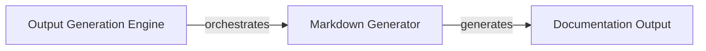

## Details

Revised analysis addressing feedback on missing/incorrect source code references and relationship redundancy, including new components and refined relationships.

### Output Generation Engine [[Expand]](./Output_Generation_Engine.md)
This component serves as the orchestrator for all documentation output. It takes the processed architectural insights and manages their transformation into user-consumable formats, including Markdown and Mermaid diagrams. Its fundamental importance lies in being the gateway for all generated documentation, ensuring consistency and format adherence.

**Related Classes/Methods**:

- <a href="https://github.com/CodeBoarding/CodeBoarding/blob/main/diagram_analysis/diagram_generator.py" target="_blank" rel="noopener noreferrer">`diagram_analysis.diagram_generator`</a>

### Markdown Generator [[Expand]](./Markdown_Generator.md)
This specialized component is responsible for generating standard Markdown documentation, including embedded Mermaid diagrams and basic component details. It ensures that complex architectural insights are presented in an easily readable and widely compatible format.

**Related Classes/Methods**:

- <a href="https://github.com/CodeBoarding/CodeBoarding/blob/main/diagram_analysis/diagram_generator.py" target="_blank" rel="noopener noreferrer">`diagram_analysis.diagram_generator`</a>

### Documentation Output
The final generated documentation, including Markdown files and embedded Mermaid diagrams.

**Related Classes/Methods**: _None_

### [FAQ](https://github.com/CodeBoarding/GeneratedOnBoardings/tree/main?tab=readme-ov-file#faq)