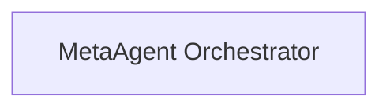

## Details

Updated analysis with a concrete source code reference for 'MetaAgent Orchestrator'.

### MetaAgent Orchestrator
Orchestrates the overall process by coordinating with other components.

**Related Classes/Methods**:

- <a href="https://github.com/CodeBoarding/CodeBoarding/blob/main/agents/meta_agent.py#L15-L37" target="_blank" rel="noopener noreferrer">`agents.meta_agent.MetaAgent`:15-37</a>

### [FAQ](https://github.com/CodeBoarding/GeneratedOnBoardings/tree/main?tab=readme-ov-file#faq)