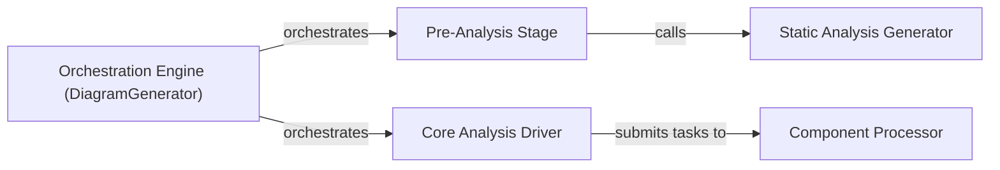

## Details

The Orchestration Engine subsystem, centered around the DiagramGenerator, manages the entire documentation generation pipeline. It coordinates analysis stages, from pre-analysis and static analysis to core analysis and component-level processing.

### Orchestration Engine (DiagramGenerator) [[Expand]](./Orchestration_Engine_DiagramGenerator_.md)
The central control unit that manages the entire documentation generation pipeline, coordinating all analysis and generation stages. It initializes and manages the lifecycle of all analysis agents.

**Related Classes/Methods**:

- `diagram_analysis.diagram_generator.DiagramGenerator`:25-202

### Pre-Analysis Stage [[Expand]](./Pre_Analysis_Stage.md)
Performs preparatory steps before the main analysis begins. This includes generating static analysis results and instantiating all the necessary AI agents with their respective contexts.

**Related Classes/Methods**:

- `diagram_analysis.diagram_generator.DiagramGenerator:pre_analysis`

### Static Analysis Generator [[Expand]](./Static_Analysis_Generator.md)
Executes the static code analysis phase. It scans the repository for programming languages, creates language-specific LSP clients, and builds static analysis data (references, call graphs, class hierarchies, package dependencies).

**Related Classes/Methods**:

- `diagram_analysis.diagram_generator.DiagramGenerator:generate_static_analysis`

### Core Analysis Driver [[Expand]](./Core_Analysis_Driver.md)
Drives the core, multi-level analysis process. It checks for updates, performs initial project abstraction, plans the analysis of components by levels, and orchestrates the parallel processing of components.

**Related Classes/Methods**:

- `diagram_analysis.diagram_generator.DiagramGenerator:generate_analysis`

### Component Processor [[Expand]](./Component_Processor.md)
Focuses on the detailed analysis of a single component. It checks for existing analysis, applies feedback if a partial update is needed, and performs a series of detailed analysis steps (sub-CFG, CFG, structure enhancement, analysis) using the DetailsAgent. It then validates the analysis and plans for new components.

**Related Classes/Methods**:

- `diagram_analysis.diagram_generator.DiagramGenerator:process_component`

### [FAQ](https://github.com/CodeBoarding/GeneratedOnBoardings/tree/main?tab=readme-ov-file#faq)