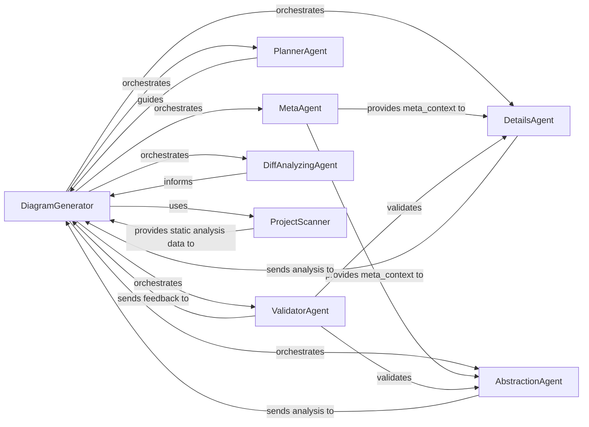

## Details

The `CodeBoarding` diagram analysis subsystem is orchestrated by the `DiagramGenerator`, which serves as the central control unit for generating comprehensive documentation. It initiates a series of specialized agents, including the `MetaAgent` for foundational context, `DetailsAgent` for granular code analysis, and `AbstractionAgent` for high-level architectural insights. The `PlannerAgent` dynamically guides the analysis process, while the `DiffAnalyzingAgent` manages incremental updates. A `ValidatorAgent` ensures the quality and consistency of the generated analysis, providing feedback to the `DiagramGenerator` for iterative refinement. The `ProjectScanner` provides initial language and static analysis data, enabling the `DiagramGenerator` to effectively coordinate the entire documentation pipeline.

### DiagramGenerator
The central control unit that manages the entire documentation generation pipeline. It initializes and manages the lifecycle of all analysis agents, orchestrating the sequential and parallel processing of code components to produce structured analysis data.

**Related Classes/Methods**:

- <a href="https://github.com/CodeBoarding/CodeBoarding/blob/main/diagram_analysis/diagram_generator.py#L25-L202" target="_blank" rel="noopener noreferrer">`DiagramGenerator`:25-202</a>

### MetaAgent
Analyzes project-level metadata to establish a foundational context for subsequent analysis stages.

**Related Classes/Methods**:

- <a href="https://github.com/CodeBoarding/CodeBoarding/blob/main/agents/meta_agent.py#L15-L37" target="_blank" rel="noopener noreferrer">`MetaAgent`:15-37</a>

### DetailsAgent
Performs detailed, low-level code analysis, including sub-CFG, CFG, and structure enhancement. Generates granular component analysis and applies feedback for refinement.

**Related Classes/Methods**:

- <a href="https://github.com/CodeBoarding/CodeBoarding/blob/main/agents/details_agent.py#L16-L113" target="_blank" rel="noopener noreferrer">`DetailsAgent`:16-113</a>

### AbstractionAgent
Generates high-level abstractions and initial comprehensive analysis of the codebase. Applies feedback for refinement.

**Related Classes/Methods**:

- <a href="https://github.com/CodeBoarding/CodeBoarding/blob/main/agents/abstraction_agent.py#L14-L100" target="_blank" rel="noopener noreferrer">`AbstractionAgent`:14-100</a>

### PlannerAgent
Dynamically determines the next set of code components or modules to be analyzed based on the current analysis results and defined depth levels.

**Related Classes/Methods**:

- <a href="https://github.com/CodeBoarding/CodeBoarding/blob/main/agents/planner_agent.py#L13-L31" target="_blank" rel="noopener noreferrer">`PlannerAgent`:13-31</a>

### ValidatorAgent
Validates the analysis generated by DetailsAgent and AbstractionAgent, identifying inconsistencies or areas for improvement and providing structured feedback.

**Related Classes/Methods**:

- <a href="https://github.com/CodeBoarding/CodeBoarding/blob/main/agents/validator_agent.py#L15-L143" target="_blank" rel="noopener noreferrer">`ValidatorAgent`:15-143</a>

### DiffAnalyzingAgent
Manages incremental analysis by checking for code changes and determining the update degree required for components. Retrieves previously stored analysis.

**Related Classes/Methods**:

- <a href="https://github.com/CodeBoarding/CodeBoarding/blob/main/agents/diff_analyzer.py#L20-L136" target="_blank" rel="noopener noreferrer">`DiffAnalyzingAgent`:20-136</a>

### ProjectScanner [[Expand]](./ProjectScanner.md)
Scans the repository to identify the programming languages present, enabling the selection of appropriate static analysis tools.

**Related Classes/Methods**:

- <a href="https://github.com/CodeBoarding/CodeBoarding/blob/main/static_analyzer/scanner.py#L13-L66" target="_blank" rel="noopener noreferrer">`ProjectScanner`:13-66</a>

### [FAQ](https://github.com/CodeBoarding/GeneratedOnBoardings/tree/main?tab=readme-ov-file#faq)