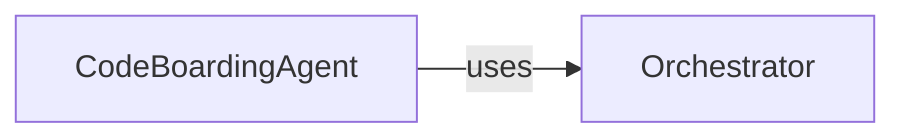

## Details

Analysis of the CodeBoarding project, focusing on the interaction between CodeBoardingAgent and Orchestrator.

### CodeBoardingAgent
The main agent responsible for orchestrating the code boarding process.

**Related Classes/Methods**: _None_

### Orchestrator [[Expand]](./Orchestrator.md)
Manages the overall flow and coordination of tasks within the system.

**Related Classes/Methods**: _None_

### [FAQ](https://github.com/CodeBoarding/GeneratedOnBoardings/tree/main?tab=readme-ov-file#faq)