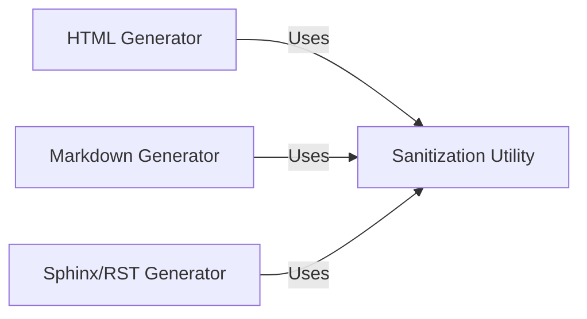

## Details

Synthesized overview of the `Output Generation Service` subsystem.

### HTML Generator
Transforms structured analysis data into an interactive HTML report. It leverages Cytoscape.js to render a dynamic, explorable graph of the system's components and their relationships.

**Related Classes/Methods**:

- `output_generators/html.py`

### Markdown Generator
Transforms structured analysis data into a static, human-readable Markdown (`.md`) document. This format is ideal for version control, wikis, and easy sharing.

**Related Classes/Methods**:

- `output_generators/markdown.py`

### Sphinx/RST Generator
Transforms structured analysis data into reStructuredText (`.rst`) files. This output is specifically formatted for integration with the Sphinx documentation generator, enabling automated project documentation.

**Related Classes/Methods**:

- `output_generators/sphinx.py`

### Sanitization Utility
Provides a centralized `sanitize` function to clean and escape text content before it is embedded in the final output. This prevents formatting errors and potential injection vulnerabilities across all generated formats.

**Related Classes/Methods**:

- `output_generators/sanitize.py`

### [FAQ](https://github.com/CodeBoarding/GeneratedOnBoardings/tree/main?tab=readme-ov-file#faq)