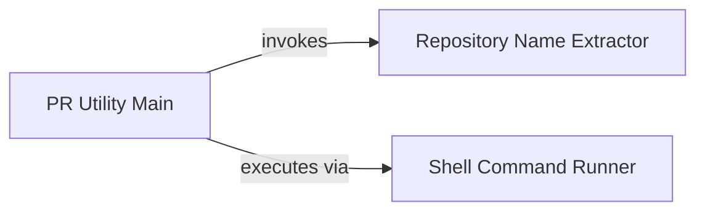

## Component Details

This component contains utility functions primarily used for external interactions with Git repositories. It automates tasks such as cloning repositories, copying generated analysis reports (markdown files) into a designated .codeboarding directory within the cloned repository, and then committing and pushing these changes.

### PR Utility Main
This component orchestrates the entire process of cloning a repository, copying onboarding documentation, and pushing changes. It takes an SSH URL as input and performs a series of steps including repository name extraction, directory management, file copying, and Git operations.

**Related Classes/Methods**:

- <a href="https://github.com/CodeBoarding/CodeBoarding/blob/master/outreach_utils/pr_util.py#L34-L113" target="_blank" rel="noopener noreferrer">`CodeBoarding.outreach_utils.pr_util:main` (34:113)</a>

### Repository Name Extractor
This component is responsible for parsing an SSH URL to extract the repository name. It uses regular expressions to identify and return the relevant part of the URL.

**Related Classes/Methods**:

- <a href="https://github.com/CodeBoarding/CodeBoarding/blob/master/outreach_utils/pr_util.py#L10-L19" target="_blank" rel="noopener noreferrer">`CodeBoarding.outreach_utils.pr_util:extract_repo_name` (10:19)</a>

### Shell Command Runner
This component executes shell commands. It handles the execution, captures output, and manages errors, providing a robust way to interact with the underlying operating system for tasks like git clone, git add, git commit, and git push.

**Related Classes/Methods**:

- <a href="https://github.com/CodeBoarding/CodeBoarding/blob/master/outreach_utils/pr_util.py#L22-L31" target="_blank" rel="noopener noreferrer">`CodeBoarding.outreach_utils.pr_util:run_command` (22:31)</a>

### [FAQ](https://github.com/CodeBoarding/GeneratedOnBoardings/tree/main?tab=readme-ov-file#faq)