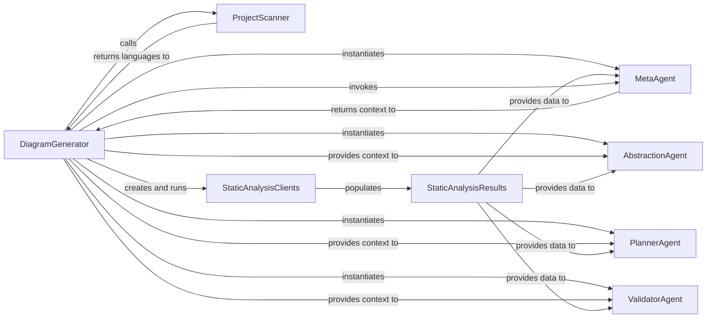

## Details

The `DiagramGenerator` serves as the central orchestrator for the pre-analysis phase. It initiates the process by leveraging the `ProjectScanner` to identify the programming languages within the repository. This information is then used to configure and execute `StaticAnalysisClients`, which perform detailed static analysis and store their findings in `StaticAnalysisResults`. Following this, the `DiagramGenerator` instantiates a set of specialized AI agents: the `MetaAgent` for high-level project context, the `AbstractionAgent` for initial code structure abstraction, the `PlannerAgent` for defining the analysis workflow, and the `ValidatorAgent` for ensuring the accuracy and quality of the analysis. The `DiagramGenerator` provides these agents with the comprehensive `StaticAnalysisResults` and the contextual insights from the `MetaAgent`, thereby guiding the subsequent, more in-depth analysis and refinement of the codebase representation.

### DiagramGenerator
Orchestrates the entire pre-analysis workflow. This includes detecting programming languages, initiating static analysis, collecting initial project metadata, and instantiating all subsequent AI agents with their necessary contexts.

**Related Classes/Methods**:

- <a href="https://github.com/CodeBoarding/CodeBoarding/blob/main/diagram_analysis/diagram_generator.py#L25-L202" target="_blank" rel="noopener noreferrer">`diagram_analysis.diagram_generator.DiagramGenerator`:25-202</a>

### ProjectScanner [[Expand]](./ProjectScanner.md)
Scans the codebase to identify the programming languages used within the repository. This information is critical for selecting appropriate static analysis tools.

**Related Classes/Methods**:

- <a href="https://github.com/CodeBoarding/CodeBoarding/blob/main/static_analyzer/scanner.py#L13-L66" target="_blank" rel="noopener noreferrer">`static_analyzer.scanner.ProjectScanner`:13-66</a>

### StaticAnalysisClients
Executes language-specific static analysis tools (e.g., Pyright for Python) to extract structural information from the code. This includes references, call graphs, class hierarchies, and package relationships.

**Related Classes/Methods**:

- <a href="https://github.com/CodeBoarding/CodeBoarding/blob/main/static_analyzer/__init__.py" target="_blank" rel="noopener noreferrer">`static_analyzer.create_clients`</a>

### StaticAnalysisResults
Acts as a central repository for all static analysis data generated during the pre-analysis phase. It aggregates and stores this information, making it accessible to other components.

**Related Classes/Methods**:

- <a href="https://github.com/CodeBoarding/CodeBoarding/blob/main/static_analyzer/analysis_result.py#L6-L138" target="_blank" rel="noopener noreferrer">`static_analyzer.analysis_result.StaticAnalysisResults`:6-138</a>

### MetaAgent
Analyzes the initial project context and metadata, providing a high-level understanding of the codebase. This context is crucial for guiding subsequent, more detailed analysis by other agents.

**Related Classes/Methods**:

- <a href="https://github.com/CodeBoarding/CodeBoarding/blob/main/agents/meta_agent.py#L15-L37" target="_blank" rel="noopener noreferrer">`agents.meta_agent.MetaAgent`:15-37</a>

### AbstractionAgent
An AI agent instantiated during the pre-analysis stage for subsequent analysis phases, focusing on abstracting code structures.

**Related Classes/Methods**:

- <a href="https://github.com/CodeBoarding/CodeBoarding/blob/main/agents/abstraction_agent.py#L14-L100" target="_blank" rel="noopener noreferrer">`agents.abstraction_agent.AbstractionAgent`:14-100</a>

### PlannerAgent
An AI agent instantiated during the pre-analysis stage for subsequent analysis phases, responsible for planning the analysis workflow.

**Related Classes/Methods**:

- <a href="https://github.com/CodeBoarding/CodeBoarding/blob/main/agents/planner_agent.py#L13-L31" target="_blank" rel="noopener noreferrer">`agents.planner_agent.PlannerAgent`:13-31</a>

### ValidatorAgent
An AI agent instantiated during the pre-analysis stage for subsequent analysis phases, likely for validating analysis outputs.

**Related Classes/Methods**:

- <a href="https://github.com/CodeBoarding/CodeBoarding/blob/main/agents/validator_agent.py#L15-L143" target="_blank" rel="noopener noreferrer">`agents.validator_agent.ValidatorAgent`:15-143</a>

### [FAQ](https://github.com/CodeBoarding/GeneratedOnBoardings/tree/main?tab=readme-ov-file#faq)