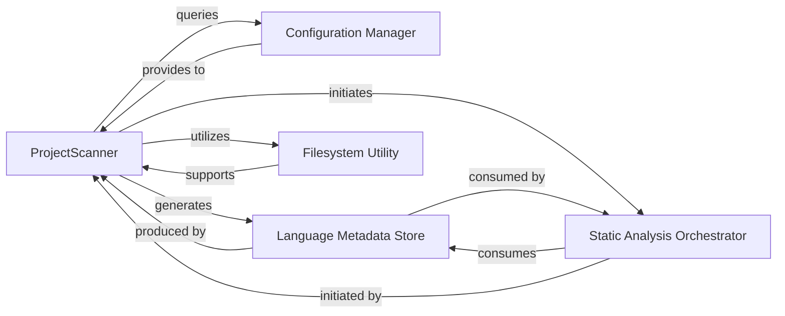

## Details

The static analysis subsystem of `CodeBoarding` is designed to efficiently scan project repositories, identify programming languages, and orchestrate deeper code analysis using Language Server Protocol (LSP) servers. The process begins with the `ProjectScanner` which acts as the primary data gatherer, leveraging configuration settings and filesystem utilities to identify relevant files and detect programming languages. The output of this initial scan, structured as `Language Metadata Store` instances, is then passed to the `Static Analysis Orchestrator` which initiates and manages the in-depth LSP-based analysis, ultimately generating comprehensive static analysis data.

### ProjectScanner [[Expand]](./ProjectScanner.md)
The core component that initiates the static analysis process. It scans the project repository, identifies relevant source files, determines programming languages used (orchestrating external tools like `github-linguist` via `subprocess`), and extracts basic project metadata. This component acts as the initial data gatherer, preparing the input for more detailed LSP-based analysis.

**Related Classes/Methods**:

- <a href="https://github.com/CodeBoarding/CodeBoarding/blob/main/static_analyzer/scanner.py#L13-L66" target="_blank" rel="noopener noreferrer">`static_analyzer.scanner.ProjectScanner`:13-66</a>

### Configuration Manager
Provides configuration details for external tools, LSP servers, and other analysis parameters. `ProjectScanner` queries this component to retrieve necessary settings for its operations.

**Related Classes/Methods**:

- <a href="https://github.com/CodeBoarding/CodeBoarding/blob/main/utils.py#L39-L51" target="_blank" rel="noopener noreferrer">`utils.get_config`:39-51</a>

### Language Metadata Store
A data structure that encapsulates detected programming language information, including file suffixes and associated LSP server commands. This structured data is the primary output of the `ProjectScanner` and serves as input for subsequent analysis stages.

**Related Classes/Methods**:

- <a href="https://github.com/CodeBoarding/CodeBoarding/blob/main/static_analyzer/programming_language.py#L7-L40" target="_blank" rel="noopener noreferrer">`static_analyzer.programming_language.ProgrammingLanguage`:7-40</a>

### Static Analysis Orchestrator
Coordinates the deeper static analysis process. It receives language metadata from the `ProjectScanner` subsystem and initiates code parsing (AST generation) and in-depth static analysis using LSP servers. This component manages the lifecycle of LSP clients and aggregates analysis results.

**Related Classes/Methods**:

- <a href="https://github.com/CodeBoarding/CodeBoarding/blob/main/static_analyzer/lsp_client/client.py#L37-L923" target="_blank" rel="noopener noreferrer">`static_analyzer.lsp_client.client.LSPClient`:37-923</a>

### Filesystem Utility
Provides robust, object-oriented utilities for manipulating filesystem paths, primarily using Python's standard `pathlib.Path` module. It is used by `ProjectScanner` for navigating the repository and managing file references.

**Related Classes/Methods**:

### [FAQ](https://github.com/CodeBoarding/GeneratedOnBoardings/tree/main?tab=readme-ov-file#faq)