```mermaid
graph LR
    API_Service["API Service"]
    Job_Database["Job Database"]
    Orchestration_Engine["Orchestration Engine"]
    Repository_Manager["Repository Manager"]
    Static_Analysis_Engine["Static Analysis Engine"]
    AI_Interpretation_Layer["AI Interpretation Layer"]
    Output_Generation_Engine["Output Generation Engine"]
    Configuration_Management["Configuration Management"]
    API_Service -- "initiates analysis jobs" --> Orchestration_Engine
    Orchestration_Engine -- "updates job status" --> Job_Database
    Orchestration_Engine -- "commands to clone/checkout repositories" --> Repository_Manager
    Orchestration_Engine -- "triggers static analysis" --> Static_Analysis_Engine
    Orchestration_Engine -- "passes static analysis results for interpretation" --> AI_Interpretation_Layer
    AI_Interpretation_Layer -- "provides interpreted data for output creation" --> Output_Generation_Engine
    Output_Generation_Engine -- "sends generated materials for upload" --> Repository_Manager
    Configuration_Management -- "provides job-specific settings" --> Orchestration_Engine
    Repository_Manager -- "provides access to cloned codebase" --> Static_Analysis_Engine
    Repository_Manager -- "provides access to cloned codebase" --> AI_Interpretation_Layer
    Static_Analysis_Engine -- "provides raw analysis data" --> AI_Interpretation_Layer
    Configuration_Management -- "provides LLM settings" --> AI_Interpretation_Layer
    click API_Service href "https://github.com/CodeBoarding/GeneratedOnBoardings/blob/main/CodeBoarding/API_Service.md" "Details"
    click Orchestration_Engine href "https://github.com/CodeBoarding/GeneratedOnBoardings/blob/main/CodeBoarding/Orchestration_Engine.md" "Details"
    click Repository_Manager href "https://github.com/CodeBoarding/GeneratedOnBoardings/blob/main/CodeBoarding/Repository_Manager.md" "Details"
    click Static_Analysis_Engine href "https://github.com/CodeBoarding/GeneratedOnBoardings/blob/main/CodeBoarding/Static_Analysis_Engine.md" "Details"
    click AI_Interpretation_Layer href "https://github.com/CodeBoarding/GeneratedOnBoardings/blob/main/CodeBoarding/AI_Interpretation_Layer.md" "Details"
    click Output_Generation_Engine href "https://github.com/CodeBoarding/GeneratedOnBoardings/blob/main/CodeBoarding/Output_Generation_Engine.md" "Details"
```

## Details

The CodeBoarding project is designed to automate the generation of onboarding documentation and architectural diagrams for software repositories. It operates by orchestrating a series of analysis steps, starting with repository management, proceeding through static and AI-driven interpretation, and culminating in the generation of structured outputs. The system is initiated via an API service, which triggers an orchestration engine to manage the workflow. Configuration settings are centrally managed, and job states are persisted in a dedicated job database.

### API Service [[Expand]](./API_Service.md)
Provides the external interface for users or other systems to initiate codebase analysis requests and retrieve results. It handles request validation, authentication, and acts as the entry point to the system.

**Related Classes/Methods**:

- <a href="https://github.com/CodeBoarding/CodeBoarding/blob/main/demo.py" target="_blank" rel="noopener noreferrer">`demo.py`</a>

### Job Database
Stores the state and metadata of ongoing and completed codebase analysis jobs, including input parameters, progress, and references to generated outputs. This is primarily handled through file system operations for caching and storing analysis results.

**Related Classes/Methods**:

- <a href="https://github.com/CodeBoarding/CodeBoarding/blob/main/demo.py" target="_blank" rel="noopener noreferrer">`demo.py:onboarding_materials_exist`</a>
- <a href="https://github.com/CodeBoarding/CodeBoarding/blob/main/demo.py" target="_blank" rel="noopener noreferrer">`demo.py:upload_onboarding_materials`</a>

### Orchestration Engine [[Expand]](./Orchestration_Engine.md)
Manages the overall workflow of a codebase analysis job, coordinating the execution of various components in the correct sequence, handling task scheduling, and managing state transitions.

**Related Classes/Methods**:

- <a href="https://github.com/CodeBoarding/CodeBoarding/blob/main/diagram_analysis/diagram_generator.py#L25-L202" target="_blank" rel="noopener noreferrer">`diagram_analysis.diagram_generator.DiagramGenerator`:25-202</a>

### Repository Manager [[Expand]](./Repository_Manager.md)
Handles all interactions with source code repositories, serving as the primary interface for fetching and managing codebases. It is responsible for fundamental, low-level operations related to local Git repositories, including cloning repositories from remote URLs, sanitizing repository URLs, verifying the existence of remote repositories, checking out specific branches or commits, and retrieving essential repository metadata (e.g., current commit hash, branch name). It also manages authentication tokens for repository access and facilitates the uploading of generated onboarding materials back to a designated location.

**Related Classes/Methods**:

- <a href="https://github.com/CodeBoarding/CodeBoarding/blob/main/repo_utils/__init__.py" target="_blank" rel="noopener noreferrer">`repo_utils.clone_repository`</a>
- <a href="https://github.com/CodeBoarding/CodeBoarding/blob/main/repo_utils/__init__.py" target="_blank" rel="noopener noreferrer">`repo_utils.upload_onboarding_materials`</a>

### Static Analysis Engine [[Expand]](./Static_Analysis_Engine.md)
Performs automated analysis of the source code to identify structural patterns, dependencies, potential issues, and extract metadata without executing the code. This includes using tools like Pyright or GitHub Linguist.

**Related Classes/Methods**:

- <a href="https://github.com/CodeBoarding/CodeBoarding/blob/main/static_analyzer/scanner.py#L13-L66" target="_blank" rel="noopener noreferrer">`static_analyzer.scanner.ProjectScanner`:13-66</a>
- <a href="https://github.com/CodeBoarding/CodeBoarding/blob/main/static_analyzer/__init__.py" target="_blank" rel="noopener noreferrer">`static_analyzer.create_clients`</a>

### AI Interpretation Layer [[Expand]](./AI_Interpretation_Layer.md)
Leverages Large Language Models (LLMs) to interpret the results of static analysis, understand code intent, generate high-level summaries, and identify key architectural components and relationships. This layer is composed of various specialized agents.

**Related Classes/Methods**:

- <a href="https://github.com/CodeBoarding/CodeBoarding/blob/main/agents/agent.py#L27-L207" target="_blank" rel="noopener noreferrer">`agents.agent.CodeBoardingAgent`:27-207</a>
- <a href="https://github.com/CodeBoarding/CodeBoarding/blob/main/agents/abstraction_agent.py" target="_blank" rel="noopener noreferrer">`agents.abstraction_agent`</a>
- <a href="https://github.com/CodeBoarding/CodeBoarding/blob/main/agents/details_agent.py" target="_blank" rel="noopener noreferrer">`agents.details_agent`</a>
- <a href="https://github.com/CodeBoarding/CodeBoarding/blob/main/agents/meta_agent.py" target="_blank" rel="noopener noreferrer">`agents.meta_agent`</a>
- <a href="https://github.com/CodeBoarding/CodeBoarding/blob/main/agents/planner_agent.py" target="_blank" rel="noopener noreferrer">`agents.planner_agent`</a>
- <a href="https://github.com/CodeBoarding/CodeBoarding/blob/main/agents/validator_agent.py" target="_blank" rel="noopener noreferrer">`agents.validator_agent`</a>

### Output Generation Engine [[Expand]](./Output_Generation_Engine.md)
Takes the interpreted results from the AI layer and static analysis, and formats them into various output types, such as interactive diagrams (Mermaid.js), documentation, or structured data.

**Related Classes/Methods**:

- <a href="https://github.com/CodeBoarding/CodeBoarding/blob/main/output_generators/markdown.py#L93-L100" target="_blank" rel="noopener noreferrer">`output_generators.markdown.generate_markdown_file`:93-100</a>
- <a href="https://github.com/CodeBoarding/CodeBoarding/blob/main/diagram_analysis/analysis_json.py#L25-L32" target="_blank" rel="noopener noreferrer">`diagram_analysis.analysis_json.from_analysis_to_json`:25-32</a>

### Configuration Management
Manages system-wide and job-specific configurations, including API keys, LLM model selections, repository access credentials, and output preferences.

**Related Classes/Methods**:

- <a href="https://github.com/CodeBoarding/CodeBoarding/blob/main/demo.py" target="_blank" rel="noopener noreferrer">`demo.py:validate_env_vars`</a>

### [FAQ](https://github.com/CodeBoarding/GeneratedOnBoardings/tree/main?tab=readme-ov-file#faq)