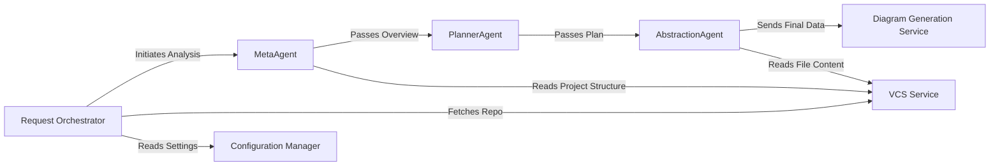

## Details

One paragraph explaining the functionality which is represented by this graph. What the main flow is and what is its purpose.

### Request Orchestrator [[Expand]](./Request_Orchestrator.md)
Serves as the primary entry point. It accepts analysis jobs from external clients (API, CI/CD), validates inputs, and initiates the analysis pipeline.

**Related Classes/Methods**:

- `local_app.py`
- <a href="https://github.com/CodeBoarding/CodeBoarding/blob/main/github_action.py" target="_blank" rel="noopener noreferrer">`github_action.py`</a>

### Configuration Manager
Loads, validates, and provides access to application settings and secrets (e.g., LLM API keys, repository configurations).

**Related Classes/Methods**:

- `config.py`

### VCS Service
Provides an abstraction layer for all Git-related operations. It handles cloning remote repositories and providing access to the local file structure for analysis.

**Related Classes/Methods**:

- `vcs.py`

### MetaAgent
The first stage in the AI pipeline. It performs a high-level scan of the entire project to understand its structure, main technologies, and overall purpose.

**Related Classes/Methods**:

- <a href="https://github.com/CodeBoarding/CodeBoarding/blob/main/agents/meta_agent.py" target="_blank" rel="noopener noreferrer">`agents/meta_agent.py`</a>

### PlannerAgent
Receives the high-level overview from the MetaAgent and creates a detailed, step-by-step execution plan for the deep analysis.

**Related Classes/Methods**:

- <a href="https://github.com/CodeBoarding/CodeBoarding/blob/main/agents/planner_agent.py" target="_blank" rel="noopener noreferrer">`agents/planner_agent.py`</a>

### AbstractionAgent
Executes the detailed plan from the PlannerAgent. It performs the core code analysis to identify components, responsibilities, and interactions, generating the final structured data.

**Related Classes/Methods**:

- <a href="https://github.com/CodeBoarding/CodeBoarding/blob/main/agents/abstraction_agent.py" target="_blank" rel="noopener noreferrer">`agents/abstraction_agent.py`</a>

### Diagram Generation Service
Consumes the final structured data from the AbstractionAgent and uses graph visualization libraries to render the final component diagram.

**Related Classes/Methods**:

- `visualization.py`

### [FAQ](https://github.com/CodeBoarding/GeneratedOnBoardings/tree/main?tab=readme-ov-file#faq)