```mermaid
graph LR
    API_Service["API Service"]
    Orchestration_Engine["Orchestration Engine"]
    Repository_Manager["Repository Manager"]
    Static_Analysis_Engine["Static Analysis Engine"]
    AI_Interpretation_Layer["AI Interpretation Layer"]
    Output_Generation_Engine["Output Generation Engine"]
    Sphinx_Generator["Sphinx Generator"]
    Configuration_Management["Configuration Management"]
    API_Service -- "initiates" --> Orchestration_Engine
    Orchestration_Engine -- "triggers" --> Repository_Manager
    Orchestration_Engine -- "initiates" --> Static_Analysis_Engine
    Orchestration_Engine -- "initiates" --> AI_Interpretation_Layer
    Orchestration_Engine -- "coordinates" --> Output_Generation_Engine
    Repository_Manager -- "provides codebase to" --> Static_Analysis_Engine
    Static_Analysis_Engine -- "provides raw analysis data to" --> AI_Interpretation_Layer
    AI_Interpretation_Layer -- "provides interpreted insights to" --> Output_Generation_Engine
    Output_Generation_Engine -- "provides processed data to" --> Sphinx_Generator
    Sphinx_Generator -- "consumes data from" --> Output_Generation_Engine
    Configuration_Management -- "provides configuration to" --> Orchestration_Engine
    Configuration_Management -- "provides configuration to" --> AI_Interpretation_Layer
    click API_Service href "https://github.com/CodeBoarding/GeneratedOnBoardings/blob/main/CodeBoarding/API_Service.md" "Details"
    click Orchestration_Engine href "https://github.com/CodeBoarding/GeneratedOnBoardings/blob/main/CodeBoarding/Orchestration_Engine.md" "Details"
    click Repository_Manager href "https://github.com/CodeBoarding/GeneratedOnBoardings/blob/main/CodeBoarding/Repository_Manager.md" "Details"
    click Static_Analysis_Engine href "https://github.com/CodeBoarding/GeneratedOnBoardings/blob/main/CodeBoarding/Static_Analysis_Engine.md" "Details"
    click AI_Interpretation_Layer href "https://github.com/CodeBoarding/GeneratedOnBoardings/blob/main/CodeBoarding/AI_Interpretation_Layer.md" "Details"
    click Output_Generation_Engine href "https://github.com/CodeBoarding/GeneratedOnBoardings/blob/main/CodeBoarding/Output_Generation_Engine.md" "Details"
    click Sphinx_Generator href "https://github.com/CodeBoarding/GeneratedOnBoardings/blob/main/CodeBoarding/Sphinx_Generator.md" "Details"
```

## Details

The system for generating documentation is centered around an Orchestration Engine, primarily embodied by the `DiagramGenerator`. This engine acts as the API Service entry point, receiving requests to generate documentation. It first interacts with a Repository Manager to access the codebase, which is then fed into a Static Analysis Engine to extract structural and semantic information. The raw analysis data is subsequently processed by an AI Interpretation Layer, comprising various specialized agents that leverage LLMs to derive high-level insights and relationships. These interpreted insights are then passed to the Output Generation Engine, which processes and stores them in a structured format (e.g., JSON). Finally, a Sphinx Generator consumes this processed data to produce the final reStructuredText documentation. Throughout this process, a Configuration Management component provides essential settings and parameters to all participating components.

### API Service [[Expand]](./API_Service.md)
The conceptual external interface for users or systems to initiate documentation generation tasks. In this context, the `DiagramGenerator` acts as the primary entry point for initiating the analysis.

**Related Classes/Methods**:

- <a href="https://github.com/CodeBoarding/CodeBoarding/blob/main/diagram_analysis/diagram_generator.py#L25-L202" target="_blank" rel="noopener noreferrer">`diagram_analysis.diagram_generator.DiagramGenerator`:25-202</a>

### Orchestration Engine [[Expand]](./Orchestration_Engine.md)
Manages and coordinates the entire documentation generation pipeline, from code retrieval and analysis to the preparation of output. It orchestrates the flow between various agents.

**Related Classes/Methods**:

- <a href="https://github.com/CodeBoarding/CodeBoarding/blob/main/diagram_analysis/diagram_generator.py#L25-L202" target="_blank" rel="noopener noreferrer">`diagram_analysis.diagram_generator.DiagramGenerator`:25-202</a>

### Repository Manager [[Expand]](./Repository_Manager.md)
Handles access to and retrieval of code repositories, providing the raw codebase for static analysis.

**Related Classes/Methods**:

- <a href="https://github.com/CodeBoarding/CodeBoarding/blob/main/agents/tools/read_file.py" target="_blank" rel="noopener noreferrer">`agents.tools.read_file.ProjectScanner`</a>

### Static Analysis Engine [[Expand]](./Static_Analysis_Engine.md)
Performs static code analysis to extract structural and semantic information (references, call graphs, class hierarchies, package dependencies) from the codebase.

**Related Classes/Methods**:

- <a href="https://github.com/CodeBoarding/CodeBoarding/blob/main/agents/tools/read_source.py" target="_blank" rel="noopener noreferrer">`agents.tools.read_source.create_clients`</a>

### AI Interpretation Layer [[Expand]](./AI_Interpretation_Layer.md)
Leverages Large Language Models (LLMs) through various agents (e.g., `DetailsAgent`, `AbstractionAgent`, `MetaAgent`, `PlannerAgent`, `ValidatorAgent`, `DiffAnalyzingAgent`) to interpret raw static analysis data, generating high-level insights, component descriptions, and relationships.

**Related Classes/Methods**:

- <a href="https://github.com/CodeBoarding/CodeBoarding/blob/main/agents/abstraction_agent.py#L14-L100" target="_blank" rel="noopener noreferrer">`agents.abstraction_agent.AbstractionAgent`:14-100</a>

### Output Generation Engine [[Expand]](./Output_Generation_Engine.md)
A core subsystem responsible for processing interpreted insights and coordinating the generation of various documentation formats. It saves the analysis results into structured JSON files.

**Related Classes/Methods**:

- <a href="https://github.com/CodeBoarding/CodeBoarding/blob/main/diagram_analysis/diagram_generator.py" target="_blank" rel="noopener noreferrer">`diagram_analysis.diagram_generator.DiagramGenerator.process_component`</a>

### Sphinx Generator [[Expand]](./Sphinx_Generator.md)
Transforms interpreted insights (likely from the JSON output of the `Output Generation Engine`) into reStructuredText (RST) formatted documentation, including embedding Mermaid diagrams and structuring component information, specifically for Sphinx documentation projects.

**Related Classes/Methods**:

- <a href="https://github.com/CodeBoarding/CodeBoarding/blob/main/diagram_analysis/diagram_generator.py#L25-L202" target="_blank" rel="noopener noreferrer">`diagram_analysis.diagram_generator.DiagramGenerator`:25-202</a>

### Configuration Management
Stores and provides configuration settings for all components, including output formats, LLM parameters, and repository details. These settings are passed during the initialization of the `DiagramGenerator` and its agents.

**Related Classes/Methods**:

- <a href="https://github.com/CodeBoarding/CodeBoarding/blob/main/diagram_analysis/diagram_generator.py" target="_blank" rel="noopener noreferrer">`diagram_analysis.diagram_generator.DiagramGenerator.__init__`</a>

### [FAQ](https://github.com/CodeBoarding/GeneratedOnBoardings/tree/main?tab=readme-ov-file#faq)